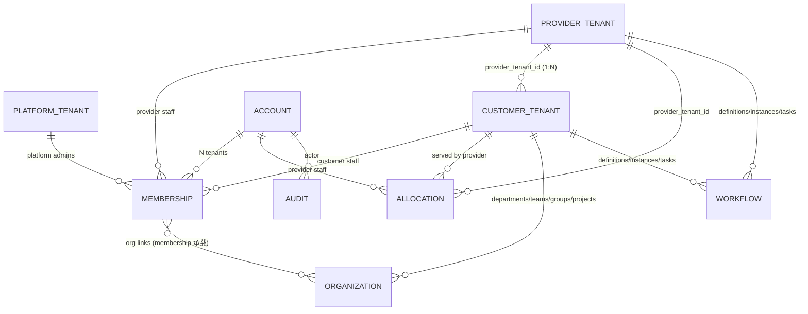
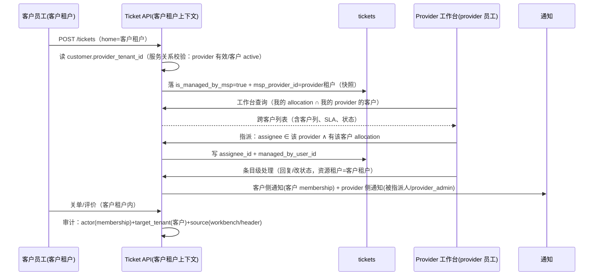

# 多租户概念模型与架构总纲（Tenant / Provider / Customer）

> 状态：**Draft v0.8（待评审）**｜日期：2026-09-29｜基准：仓库 HEAD `06c4b263`
> 定位：**概念与架构的单一权威（Canon）**。本文定义"每个概念是什么、住在哪、谁是权威、跨租户规则"，并给出与现状的映射与收敛路线；细节方案由各专题文档承接（见附录职责分工）。
> 上位决策：[ADR-004 多客户管理场景租户模型选型](../../architecture/adr-004-multi-customer-tenant-model-selection.md)（Proposed；行动项引用写作 `ADR-004:A#`）
> 关联：[目标架构方案](./msp-target-architecture.md)｜[集成分析与冲突处置](./msp-integration-with-rbac-org-workflow-analysis.md)｜[跨客户工作台与全局过滤](./msp-cross-customer-workbench-and-filter-plan.md)｜[登录与切换细化](./msp-login-and-switching-refinement-plan.md)｜[前端页面与权限分析](./msp-frontend-pages-and-permissions-analysis.md)｜[主方案](./msp-user-lifecycle-and-tenant-switching-plan.md)｜[一致性审计](./msp-docs-consistency-audit.md)

---

## 0. 摘要（TL;DR）

**问题**：`tenant`、`msp_customer`、`msp_provider` 等概念在当前实现里**散落为字段、约定与隐式单例**——`msp_provider` 只是 `tenants.type` 上的一个标签；`parent_tenant_id`/`msp_provider_id` 是只写不读的"死元数据"；分配表没有 provider 维度；账号、成员身份、角色、组织归属混在 `users` 表的不同列里。**缺少一张"概念—归属—关系"的统一图**，导致每讨论一个功能都要重新解释一遍名词。

**本文给出的架构（一句话）**：

> **租户是唯一的数据隔离边界；账号与租户是 N:N（经 Membership）；服务商与客户是租户与租户之间的服务关系（经 Allocation）；一切权限、组织、工作流都在"目标租户"内闭环计算，跨租户只走显式的条目级授权或平台治理。**

**四层收敛**：

| 层 | 概念 | 权威载体（目标） |
|---|---|---|
| 平台层 | Platform（平台运营方） | 平台租户（type=platform）+ 平台管理员 membership |
| 服务商层 | Provider（服务商组织） | provider 租户（type=provider） |
| 客户层 | Customer（被服务方/直客） | customer 租户（type=customer，含 `provider_tenant_id` 归属） |
| 关系层 | Membership / Allocation / Scope / Filter | membership 表（账号↔租户↔组织↔角色）；allocation（provider↔customer↔员工）；会话作用域；视图过滤器 |

> **Provider 与 Customer 的定位、功能与区别**（功能清单、逐维度对比、常见误解澄清）：详见 **§2.1**；**默认租户（`code=default`）与"平台/服务商同体"的部署模式矩阵**：详见 **§2.2**。

> **按角色演练**：平台/服务商/客户三种视角的逐步操作剧本（含现状/目标预期与缺口标注）见[三角色业务操作模拟剧本](./msp-three-persona-operation-simulation.md)。

**与现状的差距**（本文 §4 全表）：`type` 枚举 7 值需收敛为 3 类 + legacy 映射；membership 表**不存在**（角色/组织挂不上）；`parent_tenant_id`/`msp_provider_id` 需二选一；`MSPAllocation` 需补 provider 归属；执行器/RLS/审计需统一挂 tenantctx。

---

## 1. 概念总表（Canonical Glossary）

| # | 概念（中文） | Canonical 名 | 定义 | 权威载体 | 现状 |
|---|---|---|---|---|---|
| C1 | 平台 | **Platform** | 部署实例的运营方；不参与客户业务，负责租户/套餐/治理 | 平台租户（`internal`/`standard`）+ `super_admin` | 🟡 概念存在但未显式化 |
| C2 | 租户 | **Tenant** | **数据隔离的唯一边界**；每行业务数据以 `tenant_id` 归属 | `tenants` 表 | ✅ 表在，但 `type` 语义发散 |
| C3 | 租户类型 | **Tenant Kind** | `platform` / `provider` / `customer` 三类（canonical）；其余为 legacy 映射 | `tenants.type`（建议加约束/视图） | ❌ 7 值枚举 + legacy，语义重叠 |
| C4 | 服务商 | **Provider** | 提供 MSP 服务的组织；**一个服务商 = 一个 provider 租户**（定位/功能详见 §2.1） | provider 租户 + membership | 🟡 隐式单例（seed `default`） |
| C5 | 客户 | **Customer** | 被服务方（MSP 客户）或直客（SaaS 客户）；一个客户 = 一个 customer 租户（定位/功能详见 §2.1） | customer 租户 + `provider_tenant_id`（归属） | ❌ 归属字段为死元数据 |
| C6 | 账号 | **Account** | 登录主体（`users` 行），全局唯一（username/email） | `users` | ✅ |
| C7 | 成员身份 | **Membership** | **账号在某租户内的成员关系**：角色、组织归属、生效期、状态 | `user_tenant_memberships` 表（**待建**，概念名 membership） | ❌ 不存在（核心割裂点） |
| C8 | 作用域 | **Scope（Active Tenant）** | 一次会话/请求的"当前生效租户"，由 membership 派生 | JWT `tenant_id` + tenantctx | 🟡 有机制，但来源不统一 |
| C9 | 视图过滤器 | **View Filter** | 只看哪些客户/租户的数据（全部/子集），**不改会话** | 前端 URL + 用户偏好 | ❌ 待实现（工作台方案） |
| C10 | 服务分配 | **Allocation** | provider 员工 ↔ customer 租户的服务授权关系 | `msp_allocations`（建议补 `provider_tenant_id`） | 🟡 缺 provider 维度与归属校验 |
| C11 | 组织 | **Organization** | 租户内的部门/团队/组/项目（层级/成员） | 各实体表（均带 tenant_id）+ membership 的组织关联 | 🟡 成员关系为单值 FK，无成员行 |
| C12 | 角色与权限 | **Role / Permission** | 租户内的 RBAC；账号在某租户的角色由 membership 承载 | `roles`/`permissions`/`role_permissions`（带 tenant_id）+ membership.role | 🟡 `user_roles` 平台级豁免、双源 |
| C13 | 工作流 | **Workflow** | 审批链/BPMN/自动化/SLA：定义、实例、任务、模板均租户内 | 各工作流实体（均带 tenant_id） | 🟡 存在 4 处跨租户缺陷（集成分析 §4） |
| C14 | 审计 | **Audit** | 每条记录含 actor + membership + target_tenant + source | `auditlogs` + 各域审计 | 🟡 字段语义未统一（缺 membership/来源） |
| C15 | 部署模式 | **Deployment Mode** | `private` / `saas` / `saas_msp`：决定路由与租户形态 | `DEPLOYMENT_MODE`（env，单一来源） | 🟡 env/cfg 双源（R4） |

---

## 2. 分层与边界

```text
┌─────────────────────────── Platform 平台层 ───────────────────────────┐
│  平台租户 (type=platform, code=default)                                │
│   • 平台管理员 membership（super_admin 等）                             │
│   • 租户生命周期/套餐/全局配置/审计导出（治理模式：先选目标租户再操作）      │
└───────────────┬───────────────────────────────────────┬───────────────┘
                │ 1:N（部署策略：单 provider 或多 provider，见 D1）
                ▼
┌─────────────────────────── Provider 服务商层 ──────────────────────────┐
│  provider 租户 A（type=provider）                                       │
│   • provider 员工 membership（provider_admin / provider_agent）         │
│   • 服务商工作台：跨客户总览、全局过滤器、条目级处理（不切换会话）           │
│   • 组织：部门/团队/组/项目（租户内闭环）                                 │
└───────────────┬───────────────────────────────────────────────────────┘
                │ Allocation：provider 员工 ↔ customer 租户（1:N）
                │ Tenant 关系：customer.provider_tenant_id → provider 租户
                ▼
┌─────────────────────────── Customer 客户层 ───────────────────────────┐
│  customer 租户 X（type=customer，provider_tenant_id=A）                 │
│   • 客户员工 membership（客户内角色：end_user / 客户管理员…）             │
│   • 客户数据（工单/CMDB/知识/变更…）——永不跨租户                          │
└────────────────────────────────────────────────────────────────────────┘
```

**边界规则**：

| # | 规则 |
|---|---|
| B1 | **`tenant_id` 是唯一隔离边界**：所有业务数据必须归属一个租户；跨租户仅经显式通道（MSP 条目级授权 / 平台治理 / bounded bypass） |
| B2 | **平台 ≠ 租户数据**：平台管理员不天然拥有客户数据；治理操作必须"先选目标租户 + 审计" |
| B3 | **服务商 ≠ 超级管理员**：provider 员工访问客户数据 = membership(provider) + allocation + 目标租户 RBAC + 租户 active |
| B4 | **客户内闭环**：客户租户内的组织/角色/工作流/通知自成体系，不引用 provider 的配置 |
| B5 | **账号跨租户、权限不跨租户**：账号可有多租户 membership，但任一请求的权限只在目标租户内计算 |
| B6 | **会话作用域（Scope）与视图过滤器（Filter）分离**：过滤器只改"看什么"，条目级操作按资源租户授权，不改会话 |

### 2.1 Provider（服务商）与 Customer（客户）：定位、功能与区别（详解）

#### Provider（`msp_provider`）：服务提供方

**定位**：一个**服务商组织**（提供 IT 托管/MSP 服务的公司）。系统内它就是一个 `tenants.type=msp_provider` 的**租户**——不是平台、也不是客户。当前 `saas_msp` 部署下由 seed 创建唯一一个（`code=default`），**一个服务商 = 一个 provider 租户**。

它在系统里同时承担两个角色：

1. **服务商租户（身份与跨客户能力的归属）**：承载服务商员工账号（`users.tenant_id` = provider 租户 + `msp_role`），并作为 `/api/v1/msp/*` 路由族的身份来源；
2. **一个普通 ITSM 租户**：服务商自身的内部运维（自有工单/CMDB/知识/变更/服务目录等）也发生在这个租户内，与客户数据天然隔离、互不可见。

**功能清单（现状实现）**：

| 能力 | 说明 | 证据 |
|---|---|---|
| MSP 身份判定 | `IsMSP = home tenant 类型 ∈ {msp_provider, legacy msp} ∧ msp_role ≠ ''`；admin 不自动获得 MSP 身份 | `middleware/msp_middleware.go:91-96` |
| 角色与映射 | `provider_admin → msp_manager`（高风险面：租户开通/计费/跨客户批量，`RequireMSPManager`）；`provider_agent → msp_tech`；未知值回落 `msp_viewer`（fail-safe 收窄） | `middleware/msp_rbac.go:18-30,50` |
| 客户范围 | **只可见"已分配给自己的客户"**：`AllowedCustomers` = 有效 `MSPAllocation`；未分配客户不可见/不可操作（403） | `middleware/msp_middleware.go:104-131` |
| 跨客户能力面 | `/msp/status`、`/msp/context`、`/msp/allocations`（分配管理）、`/msp/customers`（客户列表）、`/msp/customers/:id/tickets`（客户工单）、`/msp/tickets/:id/assign`（指派）、`/msp/reports/*`（报表） | `router/msp_routes.go:20-40` |
| 目标态能力 | 跨客户工作台（列表带客户列 + 条目级处理）+ 全局过滤器；深度操作才切换作用域 | [工作台方案](./msp-cross-customer-workbench-and-filter-plan.md) |
| 生命周期 | 由平台/seed 创建；`provider_admin` 管理本服务商员工与分配；服务商的客户由 provider 开通（建客户租户 + allocation） | `pkg/seeder/seeder.go:784-833`、`service/msp_allocation_service.go` |

#### Customer（`msp_customer`）：被服务方

**定位**：**购买 MSP 托管服务的企业**（被服务方）。系统内是一个 `tenants.type=msp_customer` 的租户（SaaS 直客为 `saas_customer`，无 provider）。

**功能清单（现状实现）**：

| 能力 | 说明 | 证据 |
|---|---|---|
| 数据闭环 | 客户的工单/CMDB/知识/变更/服务目录等全部 `tenant_id` = 客户租户；**永不跨租户** | `middleware/tenant.go:133-183`（fail-closed） |
| 账号与角色 | 客户员工账号（`users.tenant_id` = 客户租户）；无 `msp_role`（legacy 值 `customer_user` 仅映射 `end_user`，且**不满足** IsMSP 条件） | `middleware/msp_rbac.go:21`、`msp_middleware.go:93` |
| MSP 路由 | **不可访问** `/api/v1/msp/*`（`IsMSP=false` → 403）；无跨客户视图、无过滤器/切换器 | `middleware/msp_rbac.go:33-46` |
| 托管可见性 | 工单上可见自己的服务商处理信息（`TicketMSPInfo`：`isManagedByMsp`/`mspProviderName`/`managedByUsername`/`mspTicketId`）——即"谁在帮我处理"，**看不到其他客户** | `dto/msp_dto.go:71-78`、`repository/ticket/repository_impl.go:961-967` |
| 内部自治 | 客户租户内的组织/角色/工作流/通知自闭环（不受 provider 配置影响） | 集成分析 §3/§4 |
| 生命周期 | 由 provider（或平台）创建；归属 provider（目标 `provider_tenant_id`）；可暂停/过期（provider 侧操作随之受限） | `service/tenant_service.go:48-52`、`middleware/msp_middleware.go` |

#### Provider vs Customer 对比

| 维度 | **msp_provider（服务商）** | **msp_customer（客户）** |
|---|---|---|
| 是什么 | 服务提供方组织 | 被服务方企业（MSP 客户）/ 直客（SaaS） |
| 租户类型 | `msp_provider`（legacy `msp`） | `msp_customer`（legacy `customer`；直客 `saas_customer`） |
| 数量关系 | 1 provider : N customers（当前部署仅 1 个 provider） | N customers : 1 provider（直客无 provider） |
| 账号与角色 | 服务商员工 + `msp_role`（`provider_admin`/`provider_agent`）→ RBAC `msp_manager`/`msp_tech` | 客户员工；无 `msp_role`（legacy `customer_user`→`end_user`） |
| MSP 路由 `/msp/*` | ✅ 可访问（受 AllowedCustomers 约束） | ❌ 403 |
| 数据可见范围 | 本服务商自有数据 + **已分配客户**的数据（allocation + 头通道/条目级授权） | **仅本租户**数据 |
| 跨租户能力 | 有（显式：allocation / 条目级授权 / 头通道只读） | 无 |
| 组织/工作流 | 本租户内 + 客户租户内（仅在授权范围与目标租户 RBAC 内） | 仅本租户 |
| 计费/套餐字段 | `billing_enabled`/`service_tier` 等 | `plan_code`/`service_tier`/`expires_at` 等 |
| 谁创建 | 平台/seed（当前部署唯一） | provider 或平台 |
| 隐私红线 | 不得看到**未分配**客户；不得跨 provider（R2 待修） | 不得看到其他客户；登录页无租户信息（I8） |

#### 与 Platform（`internal`）的区别

平台是**部署运营方**（第三个租户类型）：不是服务商、也不是客户；承载平台管理员（`super_admin`）与治理能力（租户生命周期/套餐/全局配置），治理操作须"先选目标租户 + 审计"（B2）。

#### 常见误解澄清

| 误解 | 事实 |
|---|---|
| "provider 是平台级概念" | ❌ provider 是**一个租户**（当前部署唯一）；平台是另一个租户（`internal`） |
| "所有用户都在同一个 provider 租户" | ❌ 只有**服务商员工**在 provider 租户；客户员工各自在自己的客户租户 |
| "`msp_role=customer_user` 表示客户用户" | 🟡 该值为 legacy/占位（映射 `end_user`）；客户用户实际不依赖 `msp_role`，且**不满足** IsMSP 条件 |
| "provider 能看到所有客户" | ❌ 只能看到**已分配**客户（AllowedCustomers）；未分配 → 403 |
| "服务商必须靠切换器工作" | ❌ 日常是**工作台 + 全局过滤器 + 条目级操作**；切换仅用于深度操作（I9） |

### 2.2 默认租户（`code=default`）："平台与服务商同体"的现状与拆分

**结论：当前不是"默认平台租户 + 默认 provider 租户"两个租户，而是"一个默认租户按部署模式扮演不同角色"。**

| 部署模式 | 默认租户（`code=default`）的类型与名称 | 平台管理员（super_admin）住在哪 | 客户租户 | MSP 路由 |
|---|---|---|---|---|
| `private` | `internal`（"Default Tenant"） | 默认租户 | 无（单租户自用） | ❌ 404 |
| `saas` | `internal`（"SaaS Platform Tenant"） | 默认租户 | 额外创建（`saas_customer`） | ❌ 404 |
| `saas_msp` | **`msp_provider`（"MSP Provider Tenant"）** | **同一个默认租户**（provider 租户） | 额外创建（`msp_customer`） | ✅ |

**证据**：

- `seedDefaultTenant` 只创建/维护一行 `code=default`：`saas_msp` 时 `rootType=msp_provider`，其余模式 `internal`；**已存在的 default 租户会被原地改写类型**（`pkg/seeder/seeder.go:784-833`，尤其 `:800-807`）；
- `seedAdmin`/bootstrap 把 `super_admin` 管理员建在 default 租户内（`pkg/seeder/seeder.go:849-896`、`pkg/bootstrap/token.go:141-151`）；
- `saas_msp` 下 seed **只建 provider 租户、不建客户**（`pkg/seeder/seeder_test.go:159-178`）；
- 平台管理员**不自动拥有 MSP 身份**：`RequireMSPPermission` 无 admin 旁路，`IsMSP` 必须"provider 租户类型 + `msp_role`"（`middleware/msp_rbac.go:127-137`、`middleware/msp_middleware.go:91-96`）；admin 只能走 `/msp/status` 的"管理员模式"（`handlers/msp/handler.go:48-70`）；
- default 租户受特殊保护：`code=default` 不可被暂停/过期（`handlers/tenant/handler.go:24-50`）。

**理解要点（与"两个默认租户"的差异）**：

1. `saas_msp` 下**平台管理与服务商运营同体**：同一个租户既是"服务商租户"（承载 provider 员工与 `/msp/*` 能力），又承载平台管理员账号（`super_admin`）；
2. 区分二者的不是租户，而是**角色**：`super_admin`（平台治理，无 msp_role → 非 MSP 员工）vs `provider_admin/provider_agent`（服务商员工，有 msp_role → IsMSP）；
3. 客户**不是**默认租户的一部分——每个客户是独立创建的 `msp_customer` 租户。

**风险与目标建议**：

| # | 风险 | 说明 |
|---|---|---|
| R7 | 部署模式切换**原地改写** default 租户类型（`internal ⇄ msp_provider`） | 同一行数据语义漂移；对已运行实例切换模式可能造成 provider/平台语义混乱 |
| R8 | 平台与服务商**同体**：权限边界完全依赖角色字符串 | 审计上"平台治理操作"与"服务商操作"难以区分；平台管理员可被误配 `msp_role` 而获得 MSP 能力 |

**目标（并入 D1/D5 决策）**：

- **方案 A（单 provider 部署，建议 P0）**：明确"default 租户 = provider 租户"，平台管理员以 `super_admin` 角色（无 `msp_role`）区分；加启动自检（模式与 default 类型一致、provider 唯一）+ 文档化；
- **方案 B（多 provider / 平台独立，P2 可选）**：显式拆分"平台租户（internal）+ provider 租户"，平台管理员归属平台租户，通过 membership 治理 provider；default 租户不再兼任双角色。

---

## 3. 关系模型（Canonical ER）



**基数与约束**：

| 关系 | 基数 | 约束（目标不变量） |
|---|---|---|
| Account ↔ Tenant | N:N（经 membership） | 一个账号在一个租户**至多一条有效 membership**；membership 是角色/组织/生效期的唯一载体 |
| Provider Tenant ↔ Customer Tenant | 1:N（经 `provider_tenant_id`） | customer 必填 `provider_tenant_id`（或显式标记"直客/无 provider"）；禁止指向非 provider 租户；禁止自指 |
| Account ↔ Customer Tenant | N:N（经 allocation，且账号须为 provider 员工） | allocation 的 `provider_tenant_id` 必须 == 账号 home provider 且 == customer 的 provider；admin 不豁免归属校验 |
| Membership ↔ Organization | N:N | 组织必须属于同一租户；跨租户关联被 DB/应用双重拒绝 |
| Workflow/Notification/Org ↔ Tenant | 1:N | 一律带 `tenant_id`；执行器携带 tenantctx |

**目标不变量（I1–I12，可测试）**：

| # | 不变量 |
|---|---|
| I1 | 每张业务表含 `tenant_id`，或登记于豁免清单（含理由/owner/复核期）；豁免只允许"平台实体/派生关联/平台级 RBAC"三类 |
| I2 | 权限永远在**目标租户**内计算；静态权限表仅迁移期回退且默认关闭（单源） |
| I3 | Membership 是账号↔租户关系的**唯一载体**：角色、组织归属、生效期、状态都在 membership 行上 |
| I4 | customer 租户的 `provider_tenant_id` 必填（或显式直客标记）；allocation 与 tenant 归属一致 |
| I5 | provider 员工访问客户数据需四要素齐备：provider membership + allocation + customer active + 目标租户 RBAC |
| I6 | 工作流/组织/通知解析限定目标租户；异步执行（定时器/worker/队列）必须携带 `tenantctx` |
| I7 | 跨租户写入仅两条合法路径：MSP 条目级授权（资源租户）或平台治理（显式+审计）；其余 fail-closed |
| I8 | 登录页/未认证面**不含任何租户信息**（隐私）；登录落 home 作用域（provider→provider 家） |
| I9 | Scope（会话）与 Filter（视图）分离；条目级操作不改变会话；切换仅用于深度操作 |
| I10 | 平台共享表（`global` 豁免）显式登记 + 季度复核；不新增隐式共享 |
| I11 | 审计统一含 `actor_account` + `membership` + `target_tenant` + `source`（login/header/workbench/platform） |
| I12 | 部署模式单一来源（env）；`saas_msp` 决定 provider 租户形态与 MSP 路由挂载 |

---

## 4. 概念 → 现状 → 目标 映射（"避免割裂"核心表）

| 概念 | 现状实现（证据） | 割裂点 | 目标（归一位） | 批次 |
|---|---|---|---|---|
| **Platform 平台** | `tenants.type=internal/standard`；`super_admin` 角色 | 平台身份与平台租户未绑定；admin 曾可绕过 MSP 判定（已修） | 平台租户 + 平台管理员 membership；治理操作显式选租户 | P1 |
| **Tenant 租户** | `tenants` 表；`type` 7 值枚举（`ent/schema/tenant.go:29-32`） | 枚举语义重叠（`msp`/`msp_provider`、`customer`/`msp_customer`/`saas_customer`） | 收敛为 3 类 `platform/provider/customer` + legacy 只读映射；加校验 | P0（文档+校验）/P1（数据） |
| **Provider 服务商** | 隐式单例：`saas_msp` seed 建 `code=default` 的 provider 租户（`seeder.go:784-833`） | 无唯一性约束、无配置项、无显式"provider 注册"概念 | 显式化：D1 决策（单 provider 部署约束 或 多 provider 支持 + 归属字段） | P0（决策+校验） |
| **Customer 客户** | `msp_customer`/`saas_customer` 租户 | 归属 provider 的字段是死元数据（`parent_tenant_id`/`msp_provider_id` 只写不读） | 单一 `provider_tenant_id`（NOT NULL 或显式直客标记）+ 校验 + 回填 | P0（校验）/P1（数据） |
| **Account 账号** | `users`（username/email 全局唯一）；`users.tenant_id` = home | "账号"与"某租户成员"混同（role/msp_role/department_id 全挂在 users 上） | `users` 只保留账号属性；成员属性迁 membership | P1 |
| **Membership 成员身份** | **不存在** | 角色/组织/生效期无载体；`user_roles` 平台级豁免、`msp_role` 单列 | 新建 `user_tenant_memberships(account_id, tenant_id, role_id, is_primary, status, expires_at)` | P1 |
| **Scope 作用域** | JWT `tenant_id` + `tenantctx` + `ResolveRequestTenantID`（`msp_tenant_resolver.go:29-57`） | 来源不统一（BPMN key vs tenantctx）；前端 `tenants[0]` 强制 | 由 membership 派生；执行器统一 `tenantctx`；前端尊重已选 | P0（执行器/前端） |
| **View Filter 过滤器** | 不存在（曾误设计为"全局切换"） | 与 Scope 混同 → 漏单/误操作 | `CustomerFilter`（只改视图）+ 工作台条目级操作（见工作台方案） | P0 |
| **Allocation 分配** | `msp_allocations(msp_user_id, customer_tenant_id, role)`（`ent/schema/msp_allocation.go:17-36`） | 无 provider 维度；不校验客户归属 provider；admin 跳过校验 | 补 `provider_tenant_id` + 归属一致性校验（R2 修复） | P0（校验）/P1（字段） |
| **Organization 组织** | department/team/group/project 均带 tenant_id ✅；成员为 users 单值 FK | 无成员行 → 多归属/角色/生效期无处挂；组织不参与授权 | membership 承载组织关联；组织唯一约束 `(tenant_id, code/name)` | P1 |
| **Role/Permission** | roles/permissions/role_permissions 带 tenant_id ✅；`user_roles` 豁免（无 tenant_id）；登录权限来自静态表 | 双源 + 平台级关系表 + 内存过滤 | membership.role 唯一权威；DB 单源计算；`user_roles` 收敛为平台角色 | P1 |
| **Workflow 工作流** | 实体全覆盖 tenant_id ✅；审批人解析全链路租户收窄 ✅ | 4 处缺陷（指派未验租户/授权可覆写/列表 fail-open/自动升级未接线） | 修 4 缺陷；审批人解析改走 membership/组织；异步 ctx 统一 | P0/P1 |
| **Audit 审计** | `auditlogs` + 各域审计；登录/切换审计缺失或字段不全（切换无审计） | 缺 membership/source 维度；跨租户操作不可回溯 | 统一字段：actor + membership + target_tenant + source；跨租户操作必审计 | P0/P1 |
| **Deployment Mode** | `main.go:33` 读 env；seeder 读 cfg（R4） | 双源不一致风险 | env 单一来源；启动自检（gate 与 seed 模式一致性） | P0 |

---

## 5. 术语收敛与废弃清单

| 现状同义词/歧义 | Canonical | 处置 |
|---|---|---|
| `msp_provider` / legacy `msp` | **provider** | 保留 legacy 读兼容（`IsMSPProviderTenantType` 已处理）；新数据只用 `msp_provider`；文档统一称"provider 租户" |
| `msp_customer` / `saas_customer` / legacy `customer` | **customer** | 同上；`saas_customer` 表示"无 MSP 的直客"（D2 决策后明确语义） |
| `internal` / `standard` | **platform** | 保留读兼容；新数据统一 `internal`；文档统一称"平台租户" |
| `tenants.parent_tenant_id` vs `tenants.msp_provider_id` | **`provider_tenant_id`** | 二选一（建议保留 `msp_provider_id` 改名或复用为 `provider_tenant_id`），另一个废弃并回填；加 FK 语义与校验 |
| `users.role` / `users.msp_role` / RBAC role / `user_roles` | **membership.role** | `users.role` 与 `msp_role` 降级为兼容字段（P1 后只读）；平台角色单独处理 |
| `Ticket.MspProviderID`（工单字段） | **ticket.msp_provider_id**（保留） | 与 tenant 归属一致（写入时校验）；命名保留 |
| "切换器"（顶栏） | **深度切换 ScopeSwitch** vs **过滤器 ViewFilter** | UI 两控件两语义；文档不再用"切换器"泛称 |
| `dto/msp_dto.go` 的 `MSPRole(msp_*)` 常量 | **provider_admin / provider_agent / customer_user** | 删除未引用副本（R5）；`msp_role` 取值集中校验 |
| `data_scope` 档位 `department` | **membership 部门子树** | 实现或下线（D6） |

---

## 6. 子系统挂接规范（"挂什么、挂在哪、怎么算"）

| 子系统 | 挂接点（载体） | 权威源 | 跨租户规则 |
|---|---|---|---|
| **RBAC** | membership.role → role_permissions（租户内） | DB（DBOnly） | 权限在目标租户内算；平台角色例外；`user_roles` 仅平台角色 |
| **组织** | membership ↔ org（部门/团队/组/项目） | 租户内实体表 + membership 关联 | 租户内闭环；跨租户成员关系拒绝（DB 复合约束 + 应用校验） |
| **工作流/审批** | 定义/实例/任务带 tenant_id；审批人解析 → membership/组织/角色（租户内） | 租户内定义 | 跨租户仅"条目级授权"（如 MSP 处理客户工单）；执行器带 tenantctx |
| **通知** | notification/preference/delivery 带 tenant_id；收件人 = 目标租户内 membership | 租户内偏好 | 不跨租户投递；模板共享需显式登记（D3） |
| **自动化/定时器/队列** | 任务携带 tenant_id；执行前 `WithTenantID`（claim 用 SystemContext） | 任务行 | 禁止无 ctx 执行；bounded bypass 需 actor+reason |
| **RLS** | `tenantctx` → `app.current_tenant` | 会话变量 | enforce 前先统一执行器 ctx；组织/membership 表纳入 policy |
| **审计** | actor(account) + membership + target_tenant + source | 审计表 | 跨租户操作（条目级/治理/bypass）必审计 |
| **菜单/前端** | 按目标租户生成；前端上下文由服务端响应派生 | 后端 | 前端不做租户推导；过滤器与作用域分离 |

---

## 7. 部署模式与拓扑

| 模式 | 平台租户 | Provider 租户 | Customer 租户 | MSP 路由（现状代码） | MSP 路由（目标） | 典型场景 |
|---|---|---|---|---|---|---|
| `private` | `internal`（Default Tenant） | 无 | 无（单租户自用） | ❌ 404 | ❌ 404 | 企业自建单租户 |
| `saas` | `internal`（SaaS Platform Tenant） | 无 | `saas_customer`（直客） | ✅ **开启**（与目标不符，见 R12） | ❌ 404（I12） | 纯 SaaS 多租户 |
| `saas_msp` | `internal`（同实例） | **provider 租户（当前=1 个）** | `msp_customer`（归属该 provider） | ✅ | ✅ | 服务商托管多客户 |
| 空值/未知值 | — | — | — | ✅ **开启**（静默兜底，见 R12） | ❌ 404 + 启动自检 | 配置缺失/拼写错误 |

> **现状口径**（`middleware/msp_gate.go:21-33`）：仅 `private` 关闭 MSP；`saas`/`saas_msp`/空/未知值一律开启。**目标口径**：仅 `saas_msp` 开启（I12），其余 404 + 启动自检——两列不可混读（本次审计 C1）。

**拓扑决策（D1）**——二选一，必须显式：

- **选项 A：单 provider 部署（当前事实）**——`saas_msp` = 一个服务商实例；约束落地：启动自检"provider 租户唯一"（type=msp_provider 计数 ≤1）+ `parent/provider` 字段回填与校验；
- **选项 B：多 provider 支持**——同一实例承载多个服务商；需补齐：allocation 增 `provider_tenant_id`、customer 归属校验、provider 隔离的 RBAC/报表/审计、工作台按 provider 收窄。

> 建议（含 §7.1 Superset 判定）：**模型/代码层直接按选项 B（多 provider）建模**——B 是 A 的超集（N=1 即单 provider 部署，功能全部保留）；**部署层提供"单 provider 预设"**（初始化 1 个 provider、按需隐藏 provider 管理 UI）。P0 先做校验显式化（类型/归属/mode 源/执行器 ctx），P1 落 membership + provider 维度，避免"先特例后返工"。

> **术语消歧（防割裂）**：本文 §7 的 **"选项 A/B"= 部署拓扑**（单 provider 预设 / 多 provider 模型）；§2.2 的 **"方案 A/B"= 平台-服务商拆分方案**；目标架构/主方案的 **"路线 A/B"= 实现路线**（P0 最小闭环 / P1 membership 转正）。三者互不相同，引用时必须带限定词（注册表见附录 C）。

| # | 风险（新增） | 说明 |
|---|---|---|
| R12 | **未知/空 `DEPLOYMENT_MODE` 静默开启 MSP** | `msp_gate.go` 对未知值按 SaaS 默认处理（"typo 不会静默关掉 MSP"，但会静默**打开**）；`saas` 亦开启 → 与目标 I12 不符 |

### 7.1 多 provider 架构是否覆盖单 provider 部署？（Superset 判定）

**结论：架构上是超集（N=1 退化），但"覆盖"要按三层拆开——模型/代码层统一、部署层简化、初始化层差异。**

| 层 | 单 provider 部署 | 多 provider 架构 | 覆盖判定 |
|---|---|---|---|
| 概念模型 | provider 租户 1 个，客户归属它 | provider 租户 N 个，客户归属各自 provider | ✅ 超集（N=1） |
| MSP 身份判定 | `IsMSP = provider 类型 + msp_role` | 同（每个 provider 员工在自己租户） | ✅ 同一套逻辑 |
| 客户授权 | allocation（用户↔客户） | 同 + **归属一致性校验**（R2 修复） | ✅ 单 provider 下校验恒真，无副作用 |
| 跨客户能力 | `/msp/*` + AllowedCustomers | 同 + **provider 维度收窄**（列表/报表/审计） | ✅ 单 provider 下收窄恒为全量（无感） |
| 平台/服务商边界 | **同体**（default=provider，R8） | **分离**（平台租户 + provider 租户） | ⚠️ 行为差异（见下） |
| 默认租户 | `default`=provider | `default`=platform，provider 另建 | ⚠️ 行为差异（见下） |
| 运维能力 | 不需要 provider 管理 | 需要 provider 生命周期（创建/暂停/配额/报表） | 🟡 后端必须齐备，UI 可按部署模式隐藏 |
| 迁移 | — | legacy 布局（default=provider）需迁移/兼容 | 🟡 一次性迁移脚本 + 兼容期 |

**三个必须显式化的差异**（否则"覆盖"会变成行为破坏）：

1. **默认租户语义**：多 provider 架构下 `default` = 平台租户；单 provider 部署也应"平台租户 + 1 个 provider 租户"两个租户（推荐），或保留 legacy `default=provider` 仅只读兼容 + 迁移脚本；
2. **平台与服务商分离**：多 provider 天然分离（修复 R8），单 provider 部署的管理员因此需要**两个身份**（平台管理员 membership + 可选 provider membership）——建议**不兼任**，靠 membership 区分；
3. **provider 维度约束**：所有跨客户查询/报表/审计加 provider 收窄；单 provider 下恒为唯一 provider（用户无感），但**代码路径必须一致**——不允许 `if providerCount == 1` 之类的特例分支。

**原则**：

- **模型/代码按多 provider 统一**（provider 维度无处不在，N=1 自然退化）；
- **部署按模式简化**（`saas_msp` = 多 provider 架构的"单 provider 预设"：初始化 1 个 provider、按需隐藏 provider 管理 UI）；
- **禁止特例分支**：单 provider 不是"另一种架构"，只是 N=1。

**成本对比**：

| 路线 | 一次性成本 | 长期风险 |
|---|---|---|
| 先做单 provider 特例，未来再改多 provider | 低 | **高**：模型/校验/审计/报表返工（"割裂"的真正来源） |
| **直接按多 provider 建模 + 单 provider 预设** | 中（provider 维度从一开始就在） | 低：单 provider 只是 N=1；多 provider 无需重构 |

**建议**：直接按多 provider 建模（D1 采用 B 的模型），部署上提供"单 provider 快速初始化"预设——**单 provider 部署的功能全部保留**，且 R2/R7/R8 一并消除。

**新增不变量与验收**：

- **I13**：provider 维度在所有跨客户能力中显式存在；单 provider 部署 = N=1 退化，不存在按 provider 数量分支的代码路径（UI 展示除外）；
- **A11**：同一套 e2e 用例（建 provider→建客户→分配→工作台→条目操作）在 N=1 与 N=2 下均通过，且 N=1 时无额外 UI/步骤。

### 7.2 多 provider 环境下的业务流转（以工单为例）

#### 归属原则（先定这个，流转才有唯一答案）

> **工单不"选择 provider"——工单归属客户租户，provider 归属由客户租户派生。**

- **唯一真相**：`customer_tenant.provider_tenant_id`（客户由谁服务）；
- **归属基数：1 客户 : 1 provider**——归属字段是**单值**（现状 `parent_tenant_id`/`msp_provider_id` 均为单值 int，归一后保留一个）；"多 provider"指**平台托管多个 provider（每个 provider 有自己的客户）**，不是"一个客户被多个 provider 服务"；
- **工单侧冗余快照**：建单时把 `msp_provider_id`（+`is_managed_by_msp`）写入工单，用于历史追溯、按 provider 过滤/统计/考核；客户改挂 provider 时**历史工单保留原快照**，变更需显式"重新归属"操作（审计）（决策 E2）；
- **直客**（无 provider 的 `saas_customer`）：`is_managed_by_msp=false`，纯租户内闭环，不进入 MSP 流转。

#### 目标端到端流转（客户建单 → 关单）



#### 各环节规则

| 环节 | 规则（目标） | 现状（断点） |
|---|---|---|
| 建单 | 客户租户内建单；解析客户 `provider_tenant_id` 落 MSP 快照；provider 无效/客户停用 → 按普通工单处理 | ❌ 完全不读 provider 归属；四字段零写入 |
| provider 可见 | 工作台按 **"我的 provider 的客户" ∩ "我的有效 allocation"** 收窄；头通道只读；未分配客户 403 | 🟡 仅 `TenantIDEQ(客户租户)`，无 provider 维度；`GetCustomerTicketsForMSP` 忽略 userID、无 allocation 二次校验（**R9**） |
| 指派 | assignee 必须 ∈ 工单 provider 租户 ∧ 持有该客户 allocation ∧ 客户 active；写 `managed_by_user_id` | ❌ 指派=把调用者自己写成 assignee；不写 MSP 字段；`AssignTickets`/`ReassignTicket` 不校验租户一致性 |
| 处理 | 条目级授权：provider membership + allocation + 客户租户 RBAC + 条目 allowedActions；资源租户=客户租户 | 🟡 依赖头通道/路由；无条目级 `allowedActions` |
| 通知 | 客户侧=客户 membership（requester/客户 assignee）；**provider 侧=被指派人 + provider 管理员**（新增分支） | ❌ 无 MSP 分支；provider 仅在被写成 assignee 时被动收到 |
| SLA/升级/自动化 | **客户租户配置生效**（客户数据闭环）；provider 侧考核/看板为 overlay（决策 E1） | ✅ 已按客户租户（SLA/升级/自动化均客户维度） |
| 关单/评价 | 客户租户内完成；provider 处理记录保留在工单审计 | ✅ 现状可关单；无 provider 归属记录 |
| 审计 | actor(账号+membership) + target_tenant + source + provider 快照 | ❌ 审计缺 provider/来源维度 |

#### 现状流转（供对照）

1. 客户建单 → 工单归客户租户，MSP 四字段默认/NULL；
2. 通知按客户租户 requester/assignee；
3. provider 员工走 `/api/v1/msp/*`：MSPMiddleware（provider 租户 + msp_role + allocation）→ `GetCustomerTicketsForMSP` 跨租户读；
4. MSP 指派 = 把 MSP 员工写成客户工单 `assignee_id`；
5. 解决/关单在客户租户内；**全程无 provider 归属落库、无 provider 通知、无外部工单映射**。

#### 关键风险（新增）

| # | 风险 | 证据 |
|---|---|---|
| R9 | **MSP 客户数据读取/指派未做 allocation 二次校验**：`X-Customer-Tenant-ID` 校验只覆盖**头部**；路径参数（`/msp/customers/:id/tickets`）与请求体（`AssignMSPTechnician.customerTenantId`）路径不校验 → 未分配客户可被读取/指派 | `service/ticket_service.go:2495-2517`（userID 未使用）、`handlers/msp/handler.go:202-233,236-260`、`middleware/msp_rbac.go:181-214`（仅 header） |
| R10 | `MSPAccessValidator`（`ValidateCustomerAccess`）**存在但未接线**（死代码）；`GetTicketsForCustomer`、`MSPFilterByCustomer` 同为死代码 → 新路由复用 service 会绕过授权 | `service/msp_access_validator.go`、`service/msp_allocation_service.go:277-297`、`middleware/msp_middleware.go:178-184` |
| R11 | 工单 MSP 四字段（`is_managed_by_msp`/`msp_provider_id`/`managed_by_user_id`/`msp_ticket_id`）**零写入**：无法按 provider 过滤/统计/路由/外部映射 | `ent/schema/ticket.go:130-141`；全仓无 setter；仅 `repository/ticket/repository_impl.go:910,962-969` 读取 |

#### 决策点

| # | 决策 | 建议 |
|---|---|---|
| E1 | 客户工单的 SLA/升级/工作流配置归属 | 客户租户生效（现状 ✅）；provider 考核看板作为 overlay（P2） |
| E2 | 工单 provider 归属：快照 vs 动态派生 | **快照 + 显式"重新归属"**（客户改挂 provider 时历史可追溯） |
| E3 | 是否允许转派给其他 provider | P2；必须显式 + 双向审计 |
| E4 | `msp_ticket_id`（外部工单号映射） | 有外部系统对接需求时启用（P2） |
| E5 | 直客（无 provider）工单 | `is_managed_by_msp=false`，不进 MSP 流转 |
| E6 | 是否支持"一个客户由多个 provider 服务"（主备/分工） | **当前不支持**（归属单值；allocation 亦应校验同一 provider，R2）。若业务需要：新增 `customer_provider` 服务关系表（含合同/范围/有效期）+ 工单归属/授权/审计按"服务关系"判定——比多 provider 更大的模型变更，暂不建议 |

### 7.3 provider 租户内的功能管理（双工作面与三权分立）

**问题**：provider 租户里既有"服务商自己的 ITSM"，又有"跨客户的 MSP 能力"——这两套功能如何管理？

#### 双工作面：一个租户，两个入口

| | **Home 面（服务商自有）** | **Cross 面（跨客户 MSP）** |
|---|---|---|
| 路由 | 标准路由 `/api/v1/*`（如 `/tickets`） | `/api/v1/msp/*` |
| 中间件 | `TenantMiddleware`（home=provider 租户） | `MSPMiddleware`（不挂 TenantMiddleware） |
| 数据范围 | **本 provider 租户自己的数据**（自有工单/CMDB/知识/变更） | **已分配客户**的数据（allocation 约束） |
| 身份要求 | 租户内 RBAC（provider 员工角色） | `msp_role ≠ ''` + allocation + RBAC |
| 用途 | 服务商内部运维 | 服务客户：总览/工单/指派/报表/分配管理 |

#### 跨客户能力包（Cross 面挂什么）

| 组成 | 内容 | 载体 |
|---|---|---|
| 路由族 | `/msp/status`、`/msp/context`、`/msp/customers`、`/msp/customers/:id/tickets`、`/msp/tickets/:id/assign`、`/msp/allocations`、`/msp/reports/*` | `router/msp_routes.go` |
| 资源码 | `msp`、`msp_customer`、`msp_ticket`、`msp_allocation`、`msp_report`（read/write） | `internal/authz/catalog.go:180-189` |
| 角色词表 | `msp_viewer` / `msp_tech` / `msp_specialist` / `msp_manager` / `msp_admin`（硬编码兜底：`middleware/rbac.go:438-480`） | RBAC 角色名 |
| 员工身份映射 | `provider_admin → msp_manager`；`provider_agent → msp_tech`；未知 → `msp_viewer`（fail-safe 收窄） | `middleware/msp_rbac.go:18-30` |
| 客户范围 | `MSPAllocation`（用户 ↔ 客户租户，未解除） | `msp_allocations` |

#### 授权公式（三权分立）

> **可用 = RBAC（provider 租户内的角色/权限码） ∩ Allocation（该员工被分配的客户） ∩ 客户租户内权限（目标态：目标租户 RBAC / 条目级 allowedActions）**

判定顺序（现状实现）：MSP 身份（provider 租户 + `msp_role`）→ RBAC 资源权限（在 **home=provider 租户** 计算）→ 客户范围（`X-Customer-Tenant-ID` ∈ AllowedCustomers，**仅头部**，R9）→ 业务执行（`TenantIDEQ(客户租户)`）。

#### 管理主体与入口

| 谁 | 管什么 | 入口 |
|---|---|---|
| 平台管理员 | provider 租户生命周期（创建/暂停/套餐/配额） | 租户管理 API（`/api/v1/tenants`） |
| provider_admin | 本服务商员工（建号/停用）、`msp_role`、分配（allocation）、角色权限 | 租户内用户/角色管理 + `/msp/allocations` |
| 平台共享 | `msp_*` 权限码定义 | `internal/authz/catalog.go`（码空间） |
| 脚本/供给 | 新 provider 租户的 `msp_*` 角色权限行、首个用户 | `scripts/msp/setup-msp-tenants.sh`（SQL 直写） |

#### 现状事实（重要缺口 K1–K5；K = 能力供给缺口，区别于 07 文档的生产实测缺口 G1–G10）

| # | 事实 | 影响 |
|---|---|---|
| K1 | `msp_viewer/msp_tech/msp_specialist/msp_manager/msp_admin` **不在内置角色词表**（`internal/authz/roles.go` 无这些键）→ 常规 seed 不产生其 DB 权限行 | 未走 MSP 脚本的 provider 租户落入 DBOnly「unconfigured」→ 依赖硬编码兜底（`middleware/rbac.go:1119-1140` 三态）；**角色权限无法按租户差异化** |
| K2 | 实际由 `scripts/msp/setup-msp-tenants.sh:231-233` **SQL 直写** `role_permissions`（msp_manager/msp_tech/msp_viewer/msp_specialist） | 供给脚本成为事实上的"provider 角色配置源"；绕过脚本即漂移 |
| K3 | `msp_role` 枚举仅 3 值（`provider_admin`/`provider_agent`/`customer_user`），而 RBAC 词表有 5 个 msp_* 角色 | `msp_specialist`/`msp_admin` **不可达**；细分权限无法通过员工角色表达 |
| K4 | 脚本注释记录产品缺口：MSP 管理员**无法经 API 建号**（`roleRank` 校验，`scripts/msp/setup-msp-tenants.sh:279-282`） | provider 员工管理目前依赖 SQL/脚本 |
| K5 | 客户内权限未参与（目标态才有）；`X-Customer-Tenant-ID` 只校验头部（R9） | 跨客户操作的第三重约束缺失 |

#### 复杂度预算（回答"是否越来越复杂"）

- **概念数收敛**：3 类租户（platform/provider/customer）+ 4 个关系概念（Membership/Allocation/Scope/Filter）+ **1 条授权公式**——日常只需记住这些；
- **净复杂度下降**：可删除/合并项——`msp`/`customer` legacy 值、`parent_tenant_id` vs `msp_provider_id` 二选一、`dto/msp_dto.go` 的 `MSPRole` 未引用副本、`MSPAccessValidator`/`GetTicketsForCustomer`/`MSPFilterByCustomer` 死代码、`msp_role` 并入 membership、静态权限表、`data_scope=department` 空档位；
- **新增复杂度仅在"显式化"**：provider 维度、快照字段、membership 表——它们是**把隐式约定变成可校验字段**，不是新业务概念。

#### 建议

1. **P0**：把 `msp_*` 角色纳入 `internal/authz` 词表（或明确"由 provisioning 负责"并加启动校验：provider 租户必须有 msp_* 权限行）；修 R9（三处参数统一校验）；
2. **P1**：`msp_role` 并入 membership.role（G3/G4 一并解决：员工角色可细分、建号走 membership）；供给脚本降级为一次性工具；
3. **P2**：客户内权限（第三重）落地；provider 维度报表/审计。

---

## 8. 迁移路线（从现状到目标，禁止大爆炸）

| 批次 | 主题 | 关键动作 | 依赖 |
|---|---|---|---|
| **P0 概念显式化（不改数据模型）** | 把"隐式约定"变成"校验与文档" | ① type 枚举收敛为 3 类 + legacy 映射（文档+校验函数）；② customer 归属校验（`provider_tenant_id` 一致性，R3）；③ allocation 归属校验（R2）；④ 部署模式单一来源 + 启动自检（R4、**R12**）；⑤ 执行器 ctx 统一（集成分析 §5.2）；⑥ 工作台/过滤器/条目级授权（工作台方案 P0）；⑦ 术语收敛（§5，文档+API 别名）；⑧ **MSP 读取/指派的 allocation 二次校验（R9）+ 死代码接线或删除（R10）**；⑨ **工单 MSP 快照写入（R11，建单落 `is_managed_by_msp`/`msp_provider_id`）**；⑩ **provider 租户 `msp_*` 角色供给显式化（K1/K2：纳入词表或启动校验）** | 无（可独立发布） |
| **P1 Membership 化（结构性）** | 建唯一载体，收敛角色/组织 | ① `user_tenant_memberships` 表 + 回填（home 租户 + 单值 FK 组织 + users.role/msp_role）；② 角色挂 membership（`user_roles` 收敛为平台角色）；③ 权限单源（登录/切换/`/auth/me` DB 计算）；④ 组织唯一约束与复合 FK；⑤ RLS 纳入组织/membership 表；⑥ `data_scope` 决策；⑦ 审计字段统一 | P0 |
| **P2 多 provider 与治理收尾** | 按产品决策扩展 | ① 选项 B（多 provider）字段与校验；② 共享表治理（messages/模板/is_public）；③ RLS `enforce`；④ 工作台批量/自定义视图；⑤ guard 扩展（成员/关联表一致性） | P1 |

**迁移原则**：先加列/加表并回填（只读兼容）→ 再切读路径 → 最后废弃旧列；期间双写同事务；每个批次都有独立回滚点。

---

## 9. 验收与反例（可测试）

**验收（A1–A12）**：

| # | 验收 |
|---|---|
| A1 | `tenants.type` 只出现 3 类新值；legacy 值读取正常、写入被拒（或自动映射）；文档/API 无新同义词 |
| A2 | 建 customer 租户必须携带有效 `provider_tenant_id`（或显式直客标记）；错误归属被拒绝 |
| A3 | provider A 员工无法被分配到 provider B 的客户（R2 用例）；admin 亦不豁免 |
| A4 | 一个账号可在 2 个租户各有 1 条 membership；在租户 A 的角色不影响租户 B |
| A5 | 一个账号在一个租户内可多组织归属（部门+团队），且带角色/生效期（membership 行） |
| A6 | 登录/切换/`/auth/me` 返回的 permissions 完全一致（DB 单源） |
| A7 | RLS `shadow` 下：定时器/worker/队列无"requires tenant_id"报错 |
| A8 | 跨租户写操作仅两类可成功（工作台条目级/平台治理），且均产出含 `target_tenant` 的审计 |
| A9 | 客户账号无过滤器/无切换器/无工作台（前端与 API 双重拒绝） |
| A10 | `DEPLOYMENT_MODE` 单一来源：gate 与 seed 模式一致性自检通过（R4） |
| A11 | 同一套 e2e（建 provider→建客户→分配→工作台→条目操作）在 N=1 与 N=2 下均通过，N=1 无额外 UI/步骤（§7.1） |
| A12 | 多 provider 工单流转：客户建单落 provider 快照；provider 工作台可见（provider ∩ allocation 收窄）；指派校验 assignee ∈ provider ∧ allocation；通知双投递；跨 provider/未分配客户在 API 层被拒绝（§7.2） |

**反例（必须拒绝）**：

1. 未分配客户出现在过滤器/工作台结果中；
2. 条目操作声明的 `customerTenantId` 与资源实际租户不一致；
3. 无 membership 的账号访问该租户数据；
4. 组织成员跨租户（user 属租户 A、团队属租户 B）；
5. 工作流审批人解析出他租户用户；
6. 无 tenantctx 的异步任务执行写操作；
7. 平台共享表新增未经登记的跨租户读取。

---

## 10. 开放决策（需产品/架构确认）

| # | 决策 | 选项 | 影响 |
|---|---|---|---|
| D1 | 单 provider vs 多 provider | **建议：B 的模型 + A 的部署预设**（§7.1：多 provider 覆盖单 provider，N=1 退化；§2.2 方案 A/B） | allocation 字段、RBAC/报表/审计收窄 |
| D2 | `saas_customer`（直客）是否允许"无 provider" | 允许（显式标记）/ 统一挂默认 provider | customer 归属约束 |
| D3 | 通知模板/`messages` 是否租户化 | 租户化 / 平台共享（登记） | 客户自定义文案能力 |
| D4 | 账号唯一性 vs 身份合并 | 保持全局唯一 + `identity_key`（建议）/ 改租户内唯一 | 登录与账号模型 |
| D5 | 平台管理员是否必须有 membership | 是（建议）/ 保留 users.role 特例（现状：与 provider 同体，详见 §2.2） | 平台治理审计 |
| D6 | `data_scope=department` | 实现（membership 子树）/ 下线 | 数据范围能力承诺 |
| D7 | `msp_role` 并入 membership 的时机 | P1 同批 / P2 | 迁移复杂度 |
| D8 | 工作台批量操作的边界（跨客户） | 低危动作 + 护栏（建议）/ 不开放 | 效率与风险 |
| D9 | 工单流转决策（E1–E6） | 见 §7.2：客户 SLA 归属 / 快照 vs 派生 / 转派 / 外部工单映射 / 直客 / **客户是否可多 provider 服务（E6）** | 工单与 provider 的关联语义 |
| D10 | **MSP 角色词表统一** | ① 保留代码词表（`msp_viewer/msp_tech/msp_specialist/msp_manager/msp_admin`），Q7 模板映射为 `observer→msp_viewer`、`full→msp_admin`；② 或按 Q7 重命名（含数据迁移） | 三处词表并存（代码/K1、Q7 模板、脚本 SQL）→ 授权语义歧义（审计 C4） |

---

## 附录 A：文档职责分工（单一权威，避免重复）

| 文档 | 职责（own） |
|---|---|
| **本文（Canon）** | 概念定义、分层、关系与不变量、术语收敛、子系统挂接规范、迁移路线与开放决策 |
| [目标架构方案](./msp-target-architecture.md) | 目标态详细设计：membership 模型、上下文解析、权限矩阵（Q7）、建号/邀请、数据模型与迁移、A→B 演进 |
| [集成分析与冲突处置](./msp-integration-with-rbac-org-workflow-analysis.md) | 现状取证与冲突清单（❌/🟡）、执行器/RLS/通知细则、`msp_provider` 专项核实（§11） |
| [跨客户工作台与全局过滤](./msp-cross-customer-workbench-and-filter-plan.md) | 服务商日常操作模型：Scope/Filter/条目级操作、API、批量护栏、性能 |
| [登录与切换细化](./msp-login-and-switching-refinement-plan.md) | 登录落地、隐私约束、域名/企业代码定位、深度切换、防枚举 |
| [前端页面与权限分析](./msp-frontend-pages-and-permissions-analysis.md) | 前端现状与改造清单、切换后刷新链路、路由守卫、分期验收 |
| [用户交互流程图](./msp-user-interaction-flows.md) | 10 个用户流程 + 状态机 + 流程×缺口×接口对照 |
| [主方案](./msp-user-lifecycle-and-tenant-switching-plan.md) | 生命周期与切换的实现计划（F1–F15、Q1–Q8 决策记录） |

## 附录 B：证据索引（本文引用的核心锚点）

- 租户与类型：`ent/schema/tenant.go:29-41,80-88`、`pkg/tenantmode/tenantmode.go:3-31`、`dto/tenant_dto.go:10`
- provider 隐式单例：`pkg/seeder/seeder.go:784-833`、`pkg/seeder/seeder_test.go:159-178`
- 身份与分配：`middleware/msp_middleware.go:91-131`、`middleware/msp_context.go:14-27`、`ent/schema/msp_allocation.go:17-36`、`service/msp_allocation_service.go:35-111`
- 死元数据：`service/tenant_service.go:48-52,195-199` → `dto/mappers.go:414-418`
- 权限/组织/工作流：`middleware/rbac.go:41-55,487-504,877-905`、`ent/migrate/schema.go:5724-5725`、`service/approver/*`、`internal/schema/tenant_guard.go:65-115`
- 执行器/RLS：`internal/commandbus/commandbus.go:195,241`、`config/config.go:460-464`、`database/rls/migrations/002_pilot_policies.sql:28-61`

## 附录 C：跨文档一致性登记（权威层级 + 编号注册表）

> 权威版由本文维护；审计与冲突清单见[一致性审计](./msp-docs-consistency-audit.md)。**新增编号/术语必须在此登记。**

### C.1 权威层级（冲突时的裁决顺序）

| 层级 | 文档 | 权威范围 |
|---|---|---|
| L0 选型 | `docs/architecture/adr-004-*.md`（Proposed） | 租户模型选型与行动项（引用写作 `ADR-004:A#`） |
| L1 概念 | **本文（Canon）** | 概念、边界 B1–B6、不变量 I1–I13、术语、迁移、决策 D/E |
| L2 决策修订源 | 工作台方案（REV-1–REV-5）、登录与切换细化 | 对"跨客户操作/登录落地"的最新修订，**对被修订文档有约束力** |
| L3 目标详细设计 | 目标架构方案 | membership/上下文/权限矩阵/建号/迁移（须接受 L2 修订） |
| L4 方案 | 主方案、scope-model、user-flows、frontend | 领域实现计划（局部编号，引用须加前缀） |
| L5 现状/运营 | 01–07 | 实测现状与运维手册（**不得作为目标口径**） |
| L6 演练 | 三角色操作剧本 | 操作剧本，不定义架构 |

**规则**：① 概念冲突 → canon 胜；② 实现/交互冲突 → 最新修订源（L2）胜，但**必须回填被修订文档并留指针**；③ 现状冲突 → 01–07 + 代码为准，canon 必须"现状/目标"分列；④ 引用编号带前缀；⑤ 文档状态行与修订记录必须一致。

### C.2 编号注册表

| 编号 | 归属 | 含义 | 引用写法 |
|---|---|---|---|
| `R1–R12` | 本文 | 架构/安全风险 | `R9` |
| `K1–K5` | 本文 §7.3 | provider 能力供给缺口（原 G1–G5 更名） | `K1` |
| `G1–G10` | 07-known-gaps | 生产实测缺口（唯一 G 空间） | `07:G4` |
| `F1–F15` | 主方案 | 生命周期/切换发现项 | `F7` |
| `UF-01–UF-10` | user-flows | 交互流程号（原 F-01…F-10） | `UF-05` |
| `WB1–WB6` | 工作台方案 | 工作台规则（原 G1–G6） | `WB3` |
| `REV-1–REV-5` | 工作台方案 | 对既有文档的修订项（原 R7–R11） | `REV-2` |
| `WB-R1–WB-R6` / `WB-A1–WB-A6` | 工作台方案 | 工作台风险 / 验收（局部编号，必须带前缀） | `WB-R2`、`WB-A1` |
| `D1–D10` | 本文 §10 | 开放决策 | `D10` |
| `E1–E6` | 本文 §7.2 | 工单流转决策 | `E2` |
| `I1–I13` | 本文 §6 | 不变量 | `I9` |
| `A1–A12` | 本文 §9 | 验收（canon 内裸 `A#` 仅此含义） | `A12` |
| `ADR-004:A1–A11` | ADR-004 | 行动项（必须带前缀） | `ADR-004:A8` |
| `LOGIN-A#`/`LOGIN-R#`/`LOGIN-D#`/`LOGIN-B#`/`LOGIN-F#` | 登录细化 | 文档局部编号（必须带前缀） | `LOGIN-R3` |
| `FE-A#` | 前端分析 | 文档局部验收（必须带前缀） | `FE-A1` |

### C.3 A/B/C 字母消歧（禁止裸用）

| 写法 | 含义 | 出处 |
|---|---|---|
| **实现路线 A/B** | P0 最小闭环 / P1 membership 转正 | 目标架构、主方案 |
| **部署选项 A/B** | 单 provider 预设 / 多 provider 模型 | 本文 §7 |
| **拆分方案 A/B** | 平台-服务商同体保持 / 拆分平台租户 | 本文 §2.2 |

## 修订记录

| 版本 | 日期 | 变更 |
|---|---|---|
| v0.1 | 2026-09-29 | 首版：15 个概念 Canon 定义；四层分层与 6 条边界规则；Canonical ER + 12 条不变量；概念→现状→目标映射表（14 行）；术语收敛与废弃清单；子系统挂接规范；部署模式与单/多 provider 决策；P0/P1/P2 迁移路线；验收 A1–A10 与反例；开放决策 D1–D8；文档职责分工 |
| v0.2 | 2026-09-29 | 新增 §2.1：Provider（`msp_provider`）与 Customer（`msp_customer`）的定位、功能清单（身份/角色映射/客户范围/能力面/生命周期）、逐维度对比表、与 Platform 的区别、常见误解澄清 |
| v0.3 | 2026-09-29 | 新增 §2.2：默认租户（`code=default`）部署模式矩阵——"平台与服务商同体"（saas_msp 下 default=provider 租户且承载 super_admin），区分靠角色而非租户；风险 R7（模式切换原地改写类型）/R8（治理与服务商审计难区分）；方案 A/B |
| v0.4 | 2026-09-29 | 新增 §7.1 Superset 判定：多 provider 架构是单 provider 的超集（N=1 退化），逐层覆盖表；三个必须显式化的差异（默认租户语义/平台与服务商分离/provider 维度约束）；建议"B 的模型 + A 的部署预设"；新增不变量 I13 与验收 A11 |
| v0.5 | 2026-09-29 | 新增 §7.2 多 provider 业务流转（以工单为例）：归属原则（工单归客户租户、provider 由客户派生+快照）、目标端到端时序、各环节规则与现状断点对照；新增风险 R9（路径/请求体绕过 allocation 校验）/R10（MSPAccessValidator 等死代码）/R11（工单 MSP 四字段零写入）；决策点 E1–E5；P0 增补 ⑧⑨、验收 A11/A12、决策 D9 |
| v0.6 | 2026-09-29 | 新增 §7.3 provider 租户内的功能管理：双工作面（Home/Cross）、跨客户能力包、三权分立授权公式、管理主体表；现状缺口 G1–G5（msp_* 角色不在内置词表→依赖硬编码兜底/由脚本 SQL 直写、msp_role 3 值 vs 词表 5 角色、MSP 管理员无法经 API 建号、客户内权限缺失）；复杂度预算与净减清单；P0 增补 ⑩ |
| v0.7 | 2026-09-29 | §7.2 明确归属基数 **1 客户 : 1 provider**（归属字段单值；"多 provider"= 平台托管多个 provider，非共享客户）；新增决策 E6（"一个客户由多个 provider 服务"当前不支持，需服务关系多值模型，暂不建议）；D9 引用同步 E1–E6 |
| v0.8 | 2026-09-29 | **一致性审计整改**：§7 部署门控改为"现状/目标"分列并新增 **R12**（saas/空/未知值静默开启 MSP）；§7.3 `G1–G5`→**`K1–K5`**（消除与 07:G# 重号）；membership 物理表名统一 `user_tenant_memberships`；新增 **附录 C**（权威层级 + 编号注册表 + A/B 消歧）；新增 **D10**（MSP 角色词表统一）；头部状态同步 v0.7→v0.8；关联[一致性审计](./msp-docs-consistency-audit.md) |
