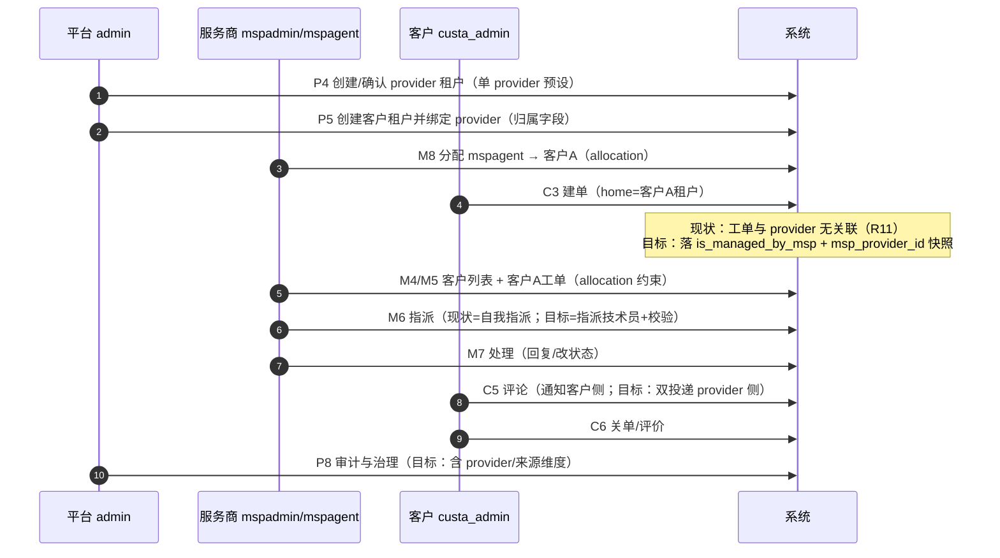

# 三角色业务操作模拟剧本（平台 / 服务商 / 客户）

> 状态：**Draft v0.1（待评审）**｜日期：2026-09-29｜基准：仓库 HEAD `1ee2642f`
> 定位：**操作剧本（Playbook）**——按"平台、服务商、客户"三种视角逐步模拟真实业务操作。每步给出：操作、请求、**现状预期行为**、**目标预期行为**、已知缺口。用于：① 手工演练/验收；② 培训与演示；③ 作为后续自动化脚本或 e2e 用例的输入规格。
> 本文**不是测试代码**，也不改动任何系统状态之外的业务数据（演练产生的工单/租户可用 `MSPCUSTA/MSPCUSTB` 命名隔离）。
> 关联：[概念模型与架构总纲](./msp-concept-model-and-architecture-canon.md)（§7.2 工单流转、§7.3 功能管理）｜[集成分析](./msp-integration-with-rbac-org-workflow-analysis.md)（风险 R1–R11）｜[工作台方案](./msp-cross-customer-workbench-and-filter-plan.md)

---

## 0. 使用方式

1. **准备拓扑**（§1）：在部署主机上执行 `scripts/msp/setup-msp-tenants.sh`（幂等），或在已有 `saas_msp` 环境上手工建租户/账号；
2. **按角色演练**：平台（§2）→ 服务商（§3）→ 客户（§4）；每步按"请求"执行，对照"现状预期"与"目标预期"；
3. **记录偏差**：若实际行为与"现状预期"不符，按 §7 缺口清单定位；若与"目标预期"不符且缺口未标注，登记为新的风险项；
4. **交叉验证**：完成 §5 时序与 §6 可见性矩阵的核对；
5. **验收**：按 §8 检查表逐项打勾（含 A11/A12 验收项）。

**约定**：`BASE=http://127.0.0.1:8088`；`Authorization: Bearer $TOKEN`；分页 `?page=&pageSize=`；所有示例中 `$X` 为占位变量。`X-Customer-Tenant-ID` 头为服务商跨客户通道（**仅头部**，见 R9）。

---

## 1. 场景与前置

### 1.1 拓扑（`saas_msp` 单 provider 预设）

```text
平台租户 default（现状：type=msp_provider，兼任平台与 provider；见总纲 §2.2）
├── 账号 admin（super_admin）                        ← 平台视角
└── 服务商 MSP001（type=msp_provider，code=MSP001）
    ├── mspadmin（role=admin, msp_role=provider_admin） ← 服务商管理员
    ├── mspagent（role=agent, msp_role=provider_agent） ← 服务商技术员
    ├── 客户 MSPCUSTA（type=msp_customer，parent/mspProvider=MSP001）
    │   └── custa_admin（role=admin, msp_role=customer_user）
    └── 客户 MSPCUSTB（type=msp_customer，parent/mspProvider=MSP001）
        └── custb_user（role=end_user, msp_role=customer_user）
```

> 目标拓扑（多 provider 模型，见总纲 §7.1）：平台租户 `internal` + N 个 provider 租户；本剧本在单 provider 下即可完整演练。

### 1.2 账号与凭证

| 视角 | 账号 | Home 租户 | `msp_role` | 密码（脚本默认） |
|---|---|---|---|---|
| 平台 | `admin` | default | — | `passw0rd` |
| 服务商 | `mspadmin` | MSP001 | `provider_admin` | `Msp@2026Staff!` |
| 服务商 | `mspagent` | MSP001 | `provider_agent` | `Msp@2026Staff!` |
| 客户 A | `custa_admin` | MSPCUSTA | `customer_user` | `Cust@2026User!` |
| 客户 B | `custb_user` | MSPCUSTB | `customer_user` | `Cust@2026User!` |

> 密码可通过环境变量覆盖（`ADMIN_PASS`/`MSP_STAFF_PASSWORD`/`CUSTOMER_PASSWORD`）。`msp_role=customer_user` 仅为数据占位，**不产生 MSP 身份**（IsMSP 要求 provider 租户类型，见总纲 §2.1）。

### 1.3 前置检查（演练开始前）

| # | 检查 | 命令/方式 | 期望 |
|---|---|---|---|
| E1 | 部署模式 | 查看后端 env `DEPLOYMENT_MODE` | `saas_msp`（否则 `/msp/*` 404） |
| E2 | MSP 路由可用 | `GET $BASE/api/v1/msp/status`（admin） | 200；`isAdmin=true`（admin 无 msp_role 时 `isMsp=false`） |
| E3 | 分配关系存在 | `GET $BASE/api/v1/msp/allocations`（mspadmin） | 含 mspagent→MSPCUSTA（脚本第 7 节建立） |
| E4 | `msp_*` 角色权限行 | 脚本已执行第 5 节（SQL 直写） | provider 租户下 `msp_manager/msp_tech/msp_viewer` 有权限行（见 K1/K2） |
| E5 | 客户租户归属字段 | `GET $BASE/api/v1/tenants/$MSPCUSTA_ID`（admin） | `parentTenantId`/`mspProviderId` 已回填（现状：**只写不读**，R3） |

---

## 2. 平台视角（Platform Persona）

**角色设定**：平台运营管理员（`admin`），负责租户生命周期与治理，**不参与客户业务**；平台管理员默认**不是 MSP 员工**（无 `msp_role`）。

| # | 操作 | 请求 | 现状预期 | 目标预期 | 缺口 |
|---|---|---|---|---|---|
| P1 | 登录 | `POST /api/v1/auth/login {"username":"admin","password":"passw0rd"}` | 200，返回 access token；登录页/响应**不含租户清单**（隐私 I8） | 同现状 | — |
| P2 | 查看自己可访问的租户 | `GET /api/v1/auth/tenants` | 返回 admin 所属租户（default） | 平台管理员可见"治理范围"租户列表（经 membership） | 现状无 membership，靠 role 特判 |
| P3 | 租户清单 | `GET /api/v1/tenants` | 200，含 default/MSP001/MSPCUSTA/MSPCUSTB；**default 的 type=msp_provider**（平台与服务商同体，R8） | 平台租户（internal）+ provider 租户分离 | R7/R8 |
| P4 | 创建服务商租户 | `POST /api/v1/tenants {"name":"MSP002","code":"MSP002","type":"msp_provider"}` | **成功**（类型无唯一约束，可建多个 → 与"单 provider 部署"矛盾，R1） | 单 provider 部署：拒绝（启动自检/约束）；多 provider：允许并纳入治理 | R1、D1 |
| P5 | 创建客户租户并绑定服务商 | `POST /api/v1/tenants {"name":"Customer C","code":"MSPCUSTC","type":"msp_customer","parentTenantId":<MSP001>,"mspProviderId":<MSP001>}` | 字段**原样落库**，无一致性校验；后续**无人消费**（R3） | `provider_tenant_id` 必填+校验（必须指向 provider 租户）；被工作台/报表/审计消费 | R3 |
| P6 | 查看租户详情 | `GET /api/v1/tenants/$MSPCUSTA_ID` | 返回 `parentTenantId`/`mspProviderId`（仅序列化） | 同上 + 归属校验状态 | R3 |
| P7 | 暂停/恢复租户 | `PUT /api/v1/tenants/$MSPCUSTC_ID/status {"status":"suspended"}` → 恢复 | 成功；**default 租户不可暂停/过期**（特殊保护） | 同现状 + 暂停后 provider 侧操作受限（I5 的 customer active 条件） | — |
| P8 | 平台治理审计 | `GET /api/v1/audit-logs`（或审计页面） | 可查操作日志；**缺 provider/来源维度**（无法区分"平台治理"与"服务商操作"，R8） | 审计含 actor(membership)+target_tenant+provider+source | R8、I11 |

**平台视角关键验证点**：

1. **平台不能直接读客户业务数据**：以 admin 调用 `GET /api/v1/msp/customers` → 403（`RequireMSPPermission` 无 admin 旁路）；`GET /api/v1/msp/status` 返回 `isAdmin=true, message="管理员模式：可配置MSP功能"`；
2. **default 保护**：`PUT /api/v1/tenants/<default_id>/status` 被拒绝；
3. **多 provider 结构可行性**：P4 成功后，`GET /api/v1/tenants?type=msp_provider` 返回 ≥2 → 证明"多 provider 在数据层可行、约束层缺失"。

---

## 3. 服务商视角（Provider Persona）

**角色设定**：`mspadmin`（provider_admin，服务商管理员）与 `mspagent`（provider_agent，技术员）。服务商有**两个工作面**（总纲 §7.3）：
- **Cross 面**：`/api/v1/msp/*`——服务客户（跨租户，受 allocation 约束）；
- **Home 面**：`/api/v1/*`——服务商自有 ITSM（本租户数据）。

### 3.1 Cross 面操作（服务客户）

| # | 操作 | 请求 | 现状预期 | 目标预期 | 缺口 |
|---|---|---|---|---|---|
| M1 | 登录 | `POST /api/v1/auth/login {"username":"mspadmin",...}` | 200；落 home 作用域（provider 租户） | 同现状 | — |
| M2 | MSP 身份 | `GET /api/v1/msp/status` | `isMsp=true, role=provider_admin, mspUserId=<id>`（若 users.role=admin 则 `isAdmin=true`） | 同现状（身份由 membership 承载） | — |
| M3 | MSP 上下文 | `GET /api/v1/msp/context` | 200；返回可访问客户列表（=有效 allocation） | 同现状 + provider 维度 | — |
| M4 | 客户列表 | `GET /api/v1/msp/customers` | **仅返回已分配客户**（mspadmin 若未分配 → 空；脚本第 7 节将 mspagent 分配给 MSPCUSTA） | 同现状 + 客户状态/SLA 摘要 | — |
| M5 | 查看客户工单 | `GET /api/v1/msp/customers/$MSPCUSTA_ID/tickets`（建议带 `X-Customer-Tenant-ID: $MSPCUSTA_ID`） | 200，返回客户 A 的工单；**不带 header 时路径参数不做 allocation 校验（R9）** | 路径参数与头部统一校验；未分配 → 403 | **R9** |
| M6 | 指派工单 | `POST /api/v1/msp/tickets/$TICKET_A_ID/assign {"customerTenantId":$MSPCUSTA_ID}` | 200；**把调用者自己写成 assignee**；不写 `managed_by_user_id`/`msp_provider_id`（R11）；body 的 customerTenantId **不做 allocation 校验**（R9） | 指派给指定技术员：校验 assignee ∈ 工单 provider ∧ 有该客户 allocation；写 `managed_by_user_id`；分配校验 | R9/R11 |
| M7 | 处理客户工单 | `POST /api/v1/tickets/$TICKET_A_ID/comments`（带 `X-Customer-Tenant-ID: $MSPCUSTA_ID`）；`PATCH /api/v1/tickets/$TICKET_A_ID/status` | 可回复/改状态（依赖头通道解析到客户租户）；授权=头部 allocation 校验 | 条目级授权（资源租户=客户租户 + allowedActions），不依赖头部 | 工作台 P0 |
| M8 | 分配管理 | `GET /api/v1/msp/allocations`；`POST /api/v1/msp/allocations {"mspUserId":<agent>,"customerTenantId":<$A>,"role":"primary"}`；`POST /api/v1/msp/allocations/deallocate {...}` | 创建/解除成功；**不校验"客户所属 provider == 员工所属 provider"**（R2） | 归属一致性校验（R2 修复） | **R2** |
| M9 | 报表 | `GET /api/v1/msp/reports/customers?startDate=&endDate=`；`/api/v1/msp/reports/performance` | 返回数据（注意 `GetMSPCustomerReports(mspTenantID)` 的入参语义现状混乱） | 按 provider 维度聚合、口径明确 | R8 |
| M10 | **隔离验证（必做）** | ① `GET /api/v1/msp/customers/$MSPCUSTB_ID/tickets` **带** header B（mspagent 未分配 B）→ **403**；② 同请求**不带** header → **200 且返回客户 B 工单**（R9 绕过）；③ `POST /api/v1/msp/tickets/$TICKET_B_ID/assign {"customerTenantId":$B}` → **200 自我指派成功**（R9） | 三条都应 403（未分配客户） | **R9**（现状必须记录为缺陷） |
| M11 | 员工管理（服务商侧） | `POST /api/v1/users {"username":"mspagent2","role":"agent","mspRole":"provider_agent",...}` | **失败**：mspadmin 的有效角色被解析为 `msp_manager`（仅 msp_* 权限），无 `user:write`，且 roleRank 校验拦截（K4） | 经 membership 建号：provider_admin 可管理本租户员工 | K4 |
| M12 | 角色权限查看 | `GET /api/v1/roles`（provider 租户） | 可见 msp_* 角色（脚本 SQL 直写，K2）；未走脚本的租户落入硬编码兜底（K1） | msp_* 角色纳入内置词表、按租户可配置 | K1/K2 |

### 3.2 Home 面操作（服务商自有业务）

| # | 操作 | 请求 | 现状预期 | 目标预期 | 缺口 |
|---|---|---|---|---|---|
| M13 | 服务商自有工单 | `GET /api/v1/tickets`（mspagent，无头通道） | 返回 **provider 租户自己的工单**（服务商内部运维）；不含任何客户工单 | 同现状；另可选"服务商考核看板"overlay | — |
| M14 | 服务商自有组织/流程 | `/api/v1/departments`、`/api/v1/workflows` 等 | 租户内闭环（与客户配置互不影响） | 同现状 | — |

**服务商视角关键验证点**：

1. **能力边界**：`mspagent`（provider_agent→msp_tech）可读客户工单/可指派，但 `GET /api/v1/msp/allocations` 仅读（write 需 msp_manager）；
2. **范围边界**：未分配客户在**带 header** 通道被 403；**不带 header 的路径/请求体通道现状可绕过（R9）**——这是本剧本最重要的演练项；
3. **身份边界**：`mspagent` 访问 `/api/v1/msp/reports/*` 需 `msp_report:read`（msp_tech 有），而"跨客户批量"类高风险面需 `provider_admin`（`RequireMSPManager`）。

---

## 4. 客户视角（Customer Persona）

**角色设定**：`custa_admin`（客户 A 管理员）与 `custb_user`（客户 B 用户）。客户**只有 Home 面**：本租户业务闭环；无 MSP 能力、无跨客户视图、无过滤器/切换器。

| # | 操作 | 请求 | 现状预期 | 目标预期 | 缺口 |
|---|---|---|---|---|---|
| C1 | 登录 | `POST /api/v1/auth/login {"username":"custa_admin",...}` | 200；登录响应**不含租户清单**（隐私 I8） | 同现状 | — |
| C2 | 我的租户 | `GET /api/v1/auth/tenants` | 仅返回 MSPCUSTA（客户只属于自己租户） | 同现状（多 membership 时列出，但客户无跨租户场景） | — |
| C3 | **建单** | `POST /api/v1/tickets {"title":"打印机故障","description":"...","type":"incident","priority":"high"}` | 200/201；工单 `tenant_id=MSPCUSTA`；**MSP 字段保持默认**（`isManagedByMsp=false`、`mspProviderId` 空 → R11） | 落 provider 快照：`is_managed_by_msp=true`、`msp_provider_id=<MSP001>`（总纲 §7.2） | **R11** |
| C4 | 查看工单列表 | `GET /api/v1/tickets` | 仅本租户工单（跨租户 fail-closed） | 同现状 + 详情展示服务商处理信息 | — |
| C5 | 追加信息/评论 | `POST /api/v1/tickets/$ID/comments` | 成功；通知触达本租户 requester/assignee（**无 provider 分支**） | 同时通知 provider 被指派人 | 通知缺口 |
| C6 | 处理与关单 | `POST /api/v1/tickets/$ID/resolve` → `POST /api/v1/tickets/$ID/close` | 成功（客户可关单/评价） | 同现状 + 关单保留 provider 处理记录 | — |
| C7 | **MSP 能力验证** | `GET /api/v1/msp/status`、`GET /api/v1/msp/customers` | **403**（IsMSP=false；`msp_role=customer_user` 不满足身份条件） | 同现状 | — |
| C8 | **隐私验证（必做）** | ① `custb_user` 访问客户 A 工单 `GET /api/v1/tickets/$TICKET_A_ID` → **404**；② `custb_user` 列表 → 仅 B 的工单 | ①404 ②仅本租户 | 同现状 | — |
| C9 | 托管可见性（目标） | 工单详情 | **看不到**服务商处理人（`ticketToResponse` 未含 MSP 字段；`TicketMSPInfo` 未被工单详情消费） | 详情显示"服务商处理中/处理人/服务商工单号"（`TicketMSPInfo`） | R11 |
| C10 | 客户内组织/流程 | `/api/v1/departments`、`/api/v1/workflows` | 租户内闭环，**不继承 provider 配置** | 同现状 | — |

**客户视角关键验证点**：

1. **无 MSP 面**：所有 `/api/v1/msp/*` 一律 403（前端亦不应出现入口）；
2. **隔离**：跨客户数据访问 404（fail-closed），无任何"全局视图"；
3. **现状与目标的差异集中在 C3/C9**：客户建单**当前不会**关联 provider（R11），工单详情也看不到服务商信息——这是多 provider 流转落地后的首要变化点。

---

## 5. 跨视角时序（三方交错）



**现状与目标的关键差异点**：②归属字段不消费（R3）→ ④建单不落快照（R11）→ ⑦指派不校验/不落字段（R9/R11）→ ⑨通知无 provider 分支 → ⑪审计缺 provider 维度。

---

## 6. 跨视角可见性矩阵

| 对象 | 平台 admin | 服务商 admin（provider_admin） | 服务商技术员（provider_agent，仅分配 A） | 客户 A | 客户 B |
|---|---|---|---|---|---|
| 租户清单 | ✅ 全部（治理） | 本租户（+可访问客户） | 本租户（+可访问客户） | 仅本租户 | 仅本租户 |
| `/msp/*` 路由 | ❌ 403（无 msp_role）；仅 `/msp/status` 管理员模式 | ✅ | ✅（能力受 msp_tech 限制） | ❌ 403 | ❌ 403 |
| 客户列表（MSP） | ❌ | ✅ = 已分配客户 | ✅ = 已分配（A） | ❌ | ❌ |
| 客户 A 工单 | ❌（须显式治理通道+审计） | ✅ | ✅（带 header 时；不带 header 现状可绕过，R9） | ✅ 本租户 | ❌ 404 |
| 客户 B 工单 | ❌ | ✅（若分配） | ❌ 应 403（**现状不带 header 可读，R9**） | ❌ 404 | ✅ 本租户 |
| 服务商自有工单 | ❌ | ✅（Home 面） | ✅（Home 面） | ❌ | ❌ |
| 分配关系 | ✅（治理） | ✅ 本 provider | ✅ 只读（msp_allocation:read） | ❌ | ❌ |
| 审计 | ✅（平台治理） | 本租户 | ❌ | ❌ | ❌ |

> 判定公式（总纲 §7.3）：**可用 = RBAC（provider 租户内角色） ∩ Allocation（客户范围） ∩ 客户租户内权限（目标态）**；任一为空即拒绝。

---

## 7. 演练会暴露的缺口清单（按步骤索引）

| 缺口 | 触发步骤 | 现象 | 处置批次 |
|---|---|---|---|
| R1 多 provider 无约束 | P4 | 可建第二个 `msp_provider` 租户，与"单 provider 部署"矛盾 | P0（自检）/P2（多 provider） |
| R2 跨 provider 分配 | M8 | provider B 员工可被分配到 provider A 的客户 | P0 |
| R3 归属字段死元数据 | P5/P6、C3 | `parentTenantId`/`mspProviderId` 只写不读，建单不消费 | P0/P1 |
| R9 allocation 校验绕过 | M5/M6/M10 | 路径参数/请求体通道未校验 → 未分配客户可读/可指派 | **P0（安全）** |
| R11 工单 MSP 字段零写入 | C3/M6/C9 | 快照不落库、详情不展示、无法按 provider 过滤 | P0 |
| K1/K2 msp_* 角色供给 | M12 | 不在内置词表；靠脚本 SQL 直写或硬编码兜底 | P0 |
| K4 服务商建号受限 | M11 | mspadmin 无法经 API 建号（roleRank） | P1（membership） |
| R8 平台/服务商审计不分 | P8 | 审计缺 provider/来源维度 | P1 |
| 通知无 provider 分支 | C5 | provider 仅在被写成 assignee 时被动收到 | P1 |
| 智能派单不含 MSP | （客户租户内自动派单） | 候选池=客户租户用户 → MSP 员工永不入选 | P1/P2 |

---

## 8. 验收检查表（演练完成后逐项打勾）

**平台（Platform）**

- [ ] P1 登录成功，响应无租户清单泄露
- [ ] P3 能区分 default/MSP001/客户租户；知晓 default 兼任 provider（R8）
- [ ] P4 记录：当前是否允许第二个 provider 租户（R1 现状）
- [ ] P5 记录：归属字段是否被校验/消费（R3 现状）
- [ ] P7 default 租户不可暂停/过期
- [ ] P8 审计现状：是否含 provider/来源维度

**服务商（Provider）**

- [ ] M2/M3 身份与上下文正确（`isMsp=true`）
- [ ] M4 客户列表 = 已分配客户（未分配不可见）
- [ ] M5/M10 带 header 的未分配客户访问 → 403
- [ ] M10 **不带 header 的未分配客户访问 → 现状是否 200（R9）**；指派是否可绕过（R9）
- [ ] M6 指派现状语义 = 自我指派；未写 MSP 字段（R11）
- [ ] M8 分配创建成功；跨 provider 分配是否被拒（R2）
- [ ] M11 服务商经 API 建号是否可行（K4）
- [ ] M13 Home 面仅见服务商自有工单

**客户（Customer）**

- [ ] C2 仅见自己租户（无切换器）
- [ ] C3 建单成功；**记录 MSP 字段现状（R11）**
- [ ] C4/C8 仅见本租户工单；跨客户访问 404
- [ ] C7 所有 `/msp/*` 403
- [ ] C9 工单详情现状是否展示服务商信息（R11）
- [ ] C10 客户组织/流程与 provider 配置互不影响

**目标态验收（A11/A12，总纲 §9）**

- [ ] A11 同一套操作在 N=1 与 N=2 provider 下一致（无特例步骤）
- [ ] A12 建单落 provider 快照 → 工作台可见（provider ∩ allocation）→ 指派校验 → 通知双投递 → 跨 provider/未分配一律拒绝

---

## 9. 执行说明

| 项 | 说明 |
|---|---|
| 执行环境 | 部署主机（`BASE` 指向后端，默认 `http://127.0.0.1:8088`）；本机无运行栈时仅作纸面推演 |
| 拓扑准备 | `scripts/msp/setup-msp-tenants.sh`（幂等）：创建 MSP001/MSPCUSTA/MSPCUSTB、供给模板、SQL 补齐 msp_* 角色权限、建 5 个账号、建立分配、打印隔离探针 |
| 演练顺序 | §1 前置检查 → §2 平台 → §3 服务商 → §4 客户 → §5 时序核对 → §6 矩阵核对 → §8 检查表 |
| 数据隔离 | 演练产生的测试租户建议命名 `MSPCUSTC`；工单标题加 `[SIM]` 前缀便于清理；**不要对 default 租户做删除/暂停操作** |
| 半自动化 | 可用 curl/Postman/Insomnia 按表执行；如需脚本化，以本文 §2–§4 表格为输入规格另行立项（**本文不含脚本/测试代码**） |
| 注意事项 | M10 的"不带 header 绕过"是**缺陷复现**（R9），不是期望行为；发现与"现状预期"不一致时按 §7 登记 |

---

## 修订记录

| 版本 | 日期 | 变更 |
|---|---|---|
| v0.1 | 2026-09-29 | 首版：三角色操作剧本（平台 8 步 / 服务商 14 步 / 客户 10 步）、跨视角时序、可见性矩阵、缺口索引（R1–R11/G1–G5）、验收检查表、执行说明 |
| v0.2 | 2026-09-29 | 一致性整改：缺口编号 `G1/G2/G4` → `K1/K2/K4`（canon §7.3 改名，避免与 07-known-gaps 的 G1–G10 重号） |
