# MSP 多租户用户交互流程图

> 状态：**Draft v0.1（待评审）**｜日期：2026-09-29｜基准：仓库 HEAD `99eb4074`
> 关联：[目标架构方案](./msp-target-architecture.md)｜[用户生命周期与租户切换方案](./msp-user-lifecycle-and-tenant-switching-plan.md)（F1–F15）｜[07 已知缺口](../07-known-gaps.md)（G1–G10）｜[01 现状架构](../01-architecture.md)｜[通知模块设计方案](../../plan/notification-module-design-plan-2026-09-29.md)
> 用途：以**用户视角**描述每个多租户交互的完整路径（含异常分支、接口、审计点与实现状态），供产品/前端/测试对齐；流程图用 Mermaid（GitHub 原生渲染；mkdocs 已配置 Mermaid 支持）。

## 0. 图例、角色与总览

**状态图例**：✅ 已实现 ｜ 🟡 部分实现 ｜ ❌ 缺失（本流程图描述的是**目标行为**）｜ ⏳ 规划中

| 角色 | 作用域 | 关键能力 |
|---|---|---|
| 平台管理员（`super_admin`/`sysadmin`） | 全域（治理模式） | 开通/暂停租户、跨租户建号、应急兜底；高危二次确认 |
| 服务商管理员（`provider_admin` → `msp_manager`） | provider 租户 + 已分配客户 | 开通客户、分配工程师、代客工单、开号（客户侧） |
| 服务商工程师（`provider_agent` → `msp_tech` 等） | provider 租户 + 已分配客户 | 代客工单处理（按角色模板） |
| 客户管理员（租户内 `admin`） | 仅本客户租户 | 本租户用户/角色/配置、MSP 权限集调整 |
| 客户用户（`end_user`/`agent`…） | 仅本客户租户 | 业务操作 |

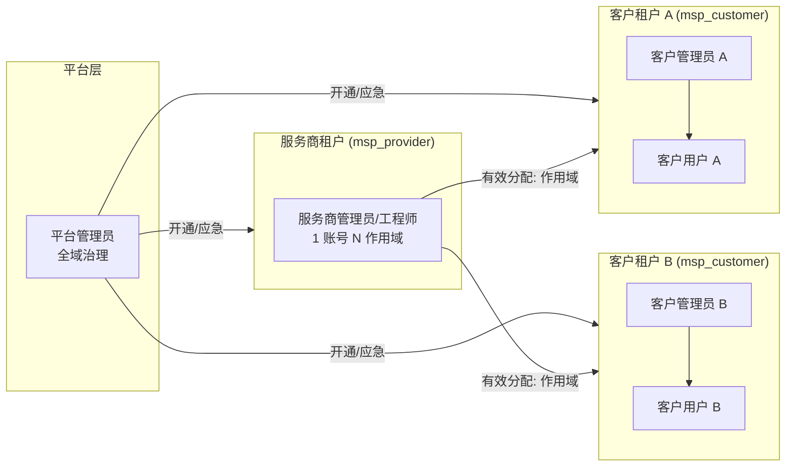

---

## 0.5 FAQ：服务商如何同时处理多个客户？（产品对齐）

**Q：服务商要处理多个客户的需求，需要切换系统吗？还是同一前端就能看到不同客户的需求？**

**A：不需要切换系统。** 目标方案是"**一套部署、一个前端、一个账号、多个作用域**"：服务商员工用同一账号登录同一前端，通过三种方式处理多客户需求——**① 跨客户总览（provider 作用域内看）**、**② 头通道单请求只读钻取**、**③ 作用域切换（切到某客户去干活）**。所谓"切换"只换**会话的当前生效作用域**，不换系统、不换账号、不换浏览器标签。

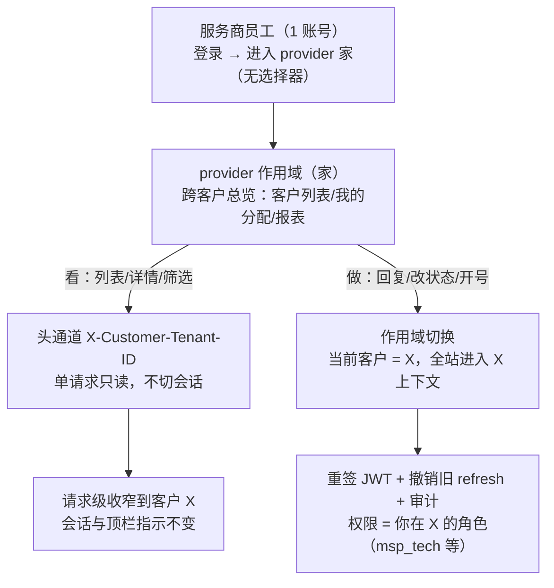

### 三种方式对照

| 场景 | 方式 | 前端表现 | 会话是否变化 |
|---|---|---|---|
| 看"我负责哪些客户、各有多少待办" | **跨客户总览**（provider 作用域） | MSP 工作台：客户列表、我的分配、跨客户工单查询、报表 | 不变 |
| 快速查看某客户的一条工单/列表，不打算改 | **头通道**（`X-Customer-Tenant-ID`） | 总览中钻取，页面带"当前客户: X（只读）"标记 | **不变**（单请求只读） |
| 回复/改状态/建号（写操作） | **作用域切换** | 顶栏切换器切到客户 X → 全站进入 X 上下文，顶栏常驻"当前客户: X" | 变（重签 JWT + 撤销旧 refresh + 审计） |

### 一次典型工作流（服务商工程师）

1. 登录 → 直接进入 **provider 作用域（家）**；登录页**不出现任何客户/租户选择器**（隐私约束，F-04）；
2. 打开 MSP 工作台：看到**所有已分配客户**的列表与各自待办（跨客户总览，无需切换）；
3. 点开客户 A 的一条工单看详情（头通道单请求只读，F-06）；
4. 需要回复/改状态 → 顶栏切换器切到**客户 A**（F-05）→ 顶栏显示"当前客户: A" → 处理（权限 = 你在 A 的角色，如 `msp_tech`：工单读写、知识/CMDB 只读）；
5. 处理完切到**客户 B**（或切回 provider 总览）；
6. 全程：一个账号、一个前端；**同一时间只有一个"当前生效作用域"**（避免"在错误的客户下操作"）。

### 边界与规则

| # | 规则 | 依据 |
|---|---|---|
| 1 | **写操作必须切换作用域**；头通道仅单请求只读 | 目标架构 §4.2、本文件 F-06 |
| 2 | 两种方式都只允许命中"有效 `MSPAllocation` 的客户集合"，未分配 → 403 + 审计 | 目标架构 §5.2/§5.4 |
| 3 | 客户方账号**永不跨租户、前端不出现切换器**（多命中即数据异常，fail-closed） | 目标架构 §3.1/§4.3 |
| 4 | 平台管理员为**治理模式**：先显式选择目标租户再操作（高危二次确认 + 审计） | 目标架构 §3.1/§4.2 |
| 5 | 权限 = RBAC × membership × 租户状态；角色/授权变更需**重登或重切**后生效 | 目标架构 §5.2/§5.3 |

### 现状 vs 目标（"同一前端看多客户"目前部分可用）

| 能力 | 状态 | 缺口 |
|---|---|---|
| MSP 管理页按客户查工单（局部钻取） | 🟡 | 仅局部查询，无统一入口 |
| 头通道中间件与分配校验 | ✅ | 未写 `tenant_source` 审计（F15） |
| 前端注入 `X-Customer-Tenant-ID` | ❌ | 仅注入 `X-Tenant-ID/X-Tenant-Code` |
| 顶栏作用域切换器 + 上下文指示 | ❌ | F13；`switchTenant` 打到不存在的端点 |
| 切换后上下文/权限刷新 | ❌ | F11（`user.tenantId` 仍回 home、权限不重算） |
| 跨客户统一聚合工作台（一列表看全部客户需求） | ⏳ | 不在本期范围（P2 评估） |

> 结论：**目标态** = 同一前端完成"总览 → 钻取 → 切换处理"全流程；**现状**需 P0 批次（切换修复 + 前端入口）后达成。**跨客户批量写**（不切换直接改多客户）不在本期范围——安全与审计成本高，属 P2 评估项。

## F-01 服务商开通客户租户

**触发**：签约新客户；**执行者**：服务商管理员（`provider_admin`）或平台管理员。

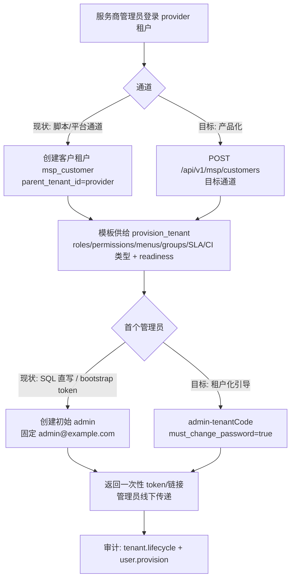

- **接口**：`POST /api/v1/tenants`（平台，现状）→ 目标 `POST /api/v1/msp/customers`；`provision_tenant -tenant-id -template-version`；bootstrap `POST /api/v1/bootstrap/create-admin`。
- **审计点**：租户创建、模板供给结果、首个管理员创建。
- **当前状态**：🟡 模板供给 ✅（`cmd/provision_tenant` + `pkg/seeder/tenant_provisioner.go`）；**无 MSP 专用开通端点**（脚本调通用 `POST /tenants`）；**首个用户无产品化路径**（脚本 SQL+pgcrypto 直写）❌。
- **异常**：租户代码/域名冲突 → 明确报错；模板版本不存在 → 供给失败并留 readiness 差异；供给中断 → 幂等重跑。

---

## F-02 客户管理员首次激活（邀请 / 引导）

**触发**：客户租户开通后，管理员获得激活链接/一次性 token。

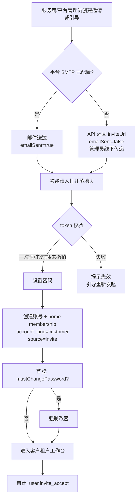

- **接口**：`POST /api/v1/users/invitations`（创建）、`GET/POST /api/v1/auth/invitations/:token`（落地页，P1-1）。
- **审计点**：`user.invite`（创建）、`user.invite_accept`（接受）。
- **当前状态**：❌ 邀请实体/接口/落地页均不存在（F4）；邮件通道未接线（`SetEmailService` 无调用点，SMTP 默认关）。
  - **过渡路径（现状可用）**：`bootstrap token` 一次性 token 打印 → 管理员线下传递；但固定身份 `admin/admin@example.com/super_admin` → **第二个租户必冲突（G2）**。
- **异常**：token 过期/已用/已撤销 → 401 + 引导重新发起；邮箱已存在 → 提示改用已有账号（客户方不跨租户）。

---

## F-03 租户内建号 / 邀请用户

**触发**：客户管理员在本租户建号；或服务商 `msp_manager` 代客户开号。

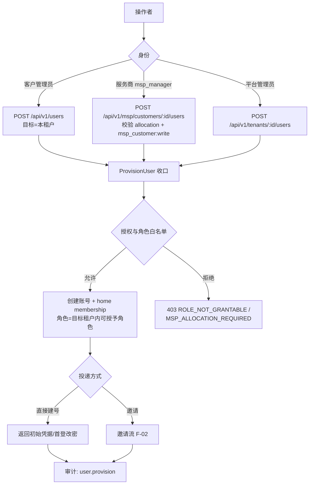

- **角色白名单（修 F3）**：仅目标租户内可授予角色；显式拒绝 `super_admin/sysadmin/admin`；`msp_role` 仅 `platform`/`msp` 通道可设置。
- **当前状态**：🟡 `POST /users` 存在且含角色高攀校验，但 ① 跨租户建号被 ent 安全 hook 拦截（**G1 未关闭**，super_admin 跨租户建号实际失败）；② `roleRank` 未定义 `msp_*`（msp_manager=0，无法建号）；③ 前端无目标租户选择（仅 `currentTenant`）。
- **异常**：用户名/邮箱重复 → `USERNAME_EXISTS/EMAIL_EXISTS`；目标租户暂停 → `TENANT_SUSPENDED`；服务方未分配 → 403。

---

## F-04 登录与作用域解析

**触发**：任意用户登录。

```mermaid
flowchart TD
    A[提交登录] --> B{显式 tenantCode?}
    B -->|有| C{租户存在且 active/未过期}
    C -->|否| X1[400 TENANT_NOT_FOUND<br/>或 TENANT_SUSPENDED/EXPIRED]
    C -->|是| D[身份定位 username/email]
    B -->|无| D
    D --> E{account_kind}
    E -->|customer| F{active 作用域数}
    F -->|恰好 1| G[自动进入该租户]
    F -->|>1| X2[409 SESSION_AMBIGUOUS<br/>数据异常告警]
    E -->|provider| H[进入 provider 作用域（家）<br/>登录页无选择器（隐私）]
    H --> G
    E -->|platform| M[进入平台控制台<br/>认证后再选目标租户]
    M --> G
    G --> N[签发 access+refresh<br/>JWT{tenant_id,tenant_source,membership_id}]
    N --> O[更新 last_active_tenant_id]
    O --> P[审计: auth.login]
```

- **接口**：`POST /api/v1/auth/login`（响应仅 `tenantSelection{mode}` 提示，**不含候选列表**）、`GET /api/v1/auth/tenants`（home ∪ 分配 ∪ 平台；**仅认证后**，供顶栏切换器）。
- **当前状态**：🟡 ① 登录不校验租户状态/过期（**F5**）；② 无单租户自动选择逻辑；③ `GET /auth/tenants` 只返回 home（**F9**）；④ 登录时把 `users.role` 覆盖为 MSP 映射角色（**G3**）；⑤ 注册接口可注入 `super_admin`（**F3**）。
- **异常**：客户方多作用域 = 数据异常（不自动选）；服务方无有效作用域 → 403/引导联系管理员；JWT 与会话不一致 → 401。

---

## F-05 服务方作用域切换

**触发**：服务商员工在顶栏切换"当前客户"（运行期，连续操作/写场景）。

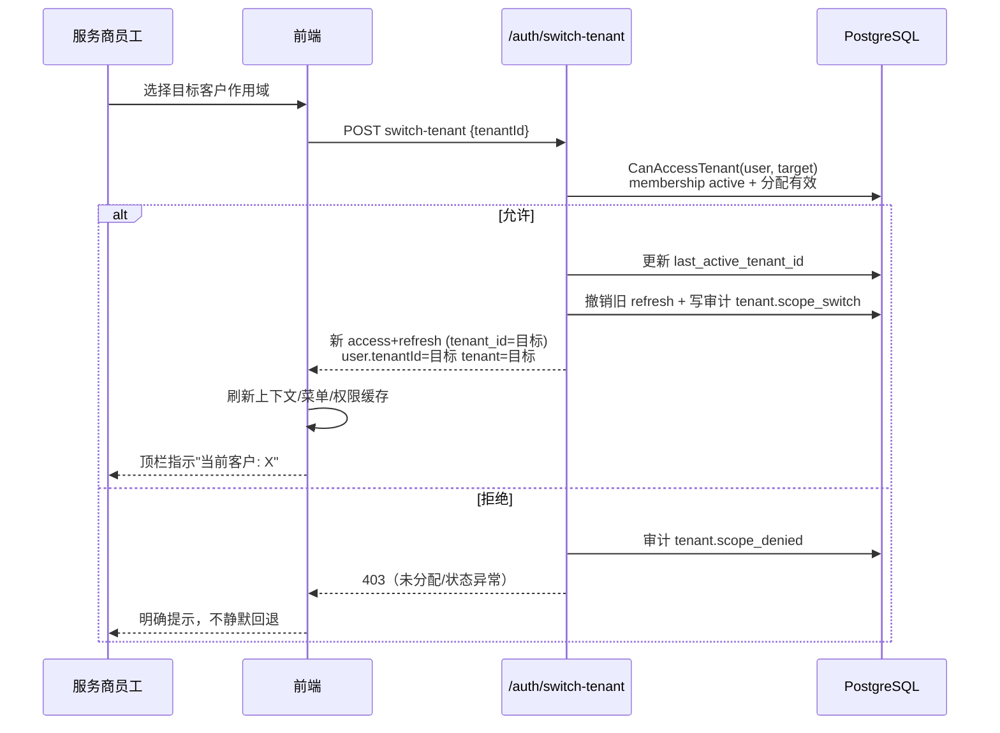

- **接口**：`POST /api/v1/auth/switch-tenant`。
- **审计点**：`tenant.scope_switch`（from/to/source/result/ip/ua）、`tenant.scope_denied`。
- **当前状态**：🟡 允许条件已实现（native/super_admin/有效分配 + 目标状态校验）；但 ① 响应 `user.tenantId` 仍为 home 租户（**F11**）；② 权限用静态表、不随切换刷新（**F11**）；③ 无审计、无旧令牌撤销（**F12**）；④ 前端 `tenant-api.ts` 打到不存在的 `/api/v1/tenants/switch`。
- **异常**：切换后旧 refresh 立即失效（防回退）；目标作用域被回收 → 403 + 当前会话保持原作用域。

---

## F-06 服务方跨客户头通道（单请求只读）

**触发**：服务商员工在"客户列表/工单列表"等**只读聚合视图**中按客户维度查看，不切换会话。

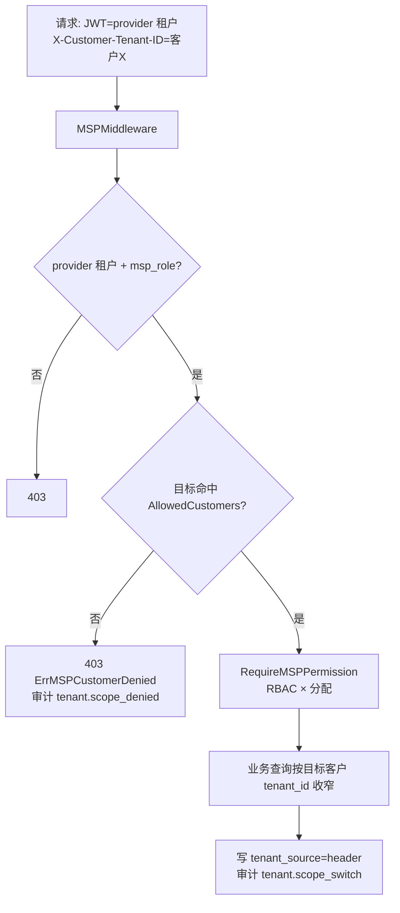

- **接口**：现有 `/api/v1/msp/*` 路由族（非租户组）；头通道**仅单请求只读**，写操作必须走切换（F-05）。
- **当前状态**：🟡 中间件与解析器 ✅（`middleware/msp_middleware.go:27-173`、`msp_tenant_resolver.go:29-57`）；`ValidateCustomerTenantHeader` 定义未挂载；**未写 `tenant_source` 进审计（F15）**。
- **异常**：头与 JWT 冲突（非服务方身份携带）→ 401；头指向未分配客户 → 403。

---

## F-07 权限与角色变更（Q7 客户级差异化）

**触发**：客户管理员调整服务方在本租户的 `msp_*` 角色权限集；或服务商管理员调整工程师分配。

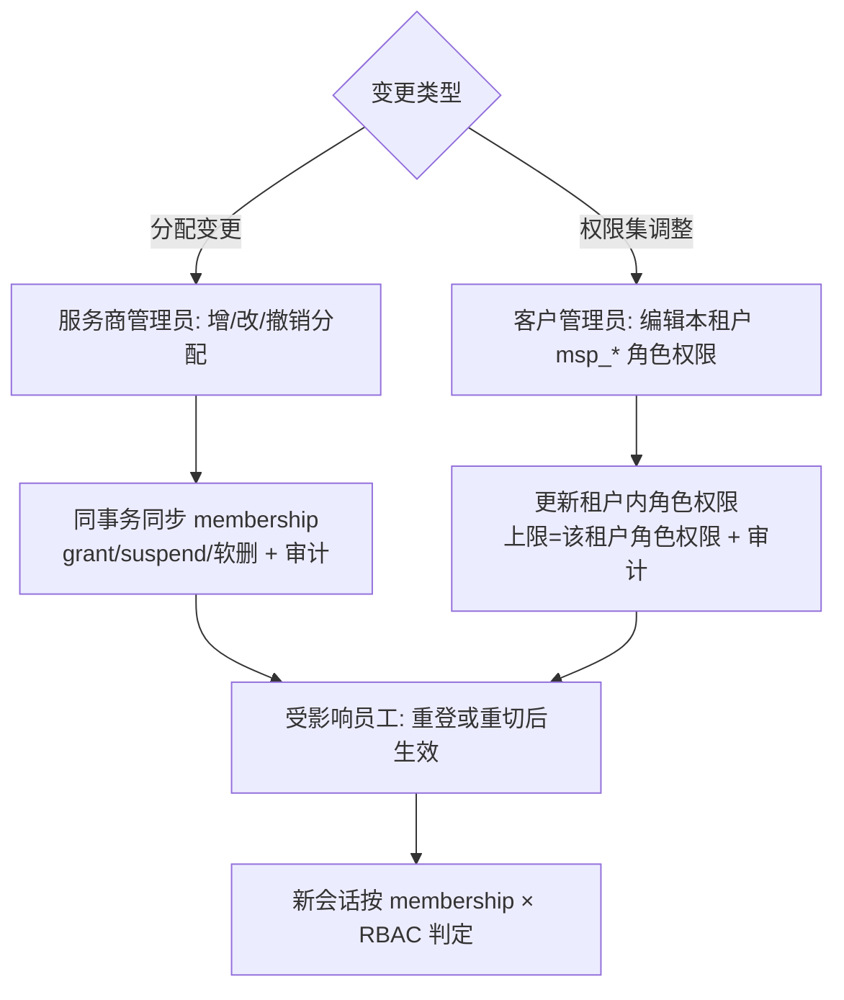

- **规则**：授予方 = 客户 admin 为主、平台应急兜底；**服务方不可自我扩权**；角色/授权变更**不热更**（重登/重切生效）。
- **审计点**：`membership.grant/revoke/suspend/role_change`、角色权限变更。
- **当前状态**：❌ 4 个 `msp_*` 角色模板为规划（P1-3）；现状 `msp_role` 枚举为 `provider_admin/provider_agent/customer_user`，客户租户内无差异化权限集；`roleRank` 缺 `msp_*` 定义。
- **异常**：越权授予（超出自身权限集）→ 403 `ROLE_NOT_GRANTABLE`；撤销最后一个 owner → 拒绝（防孤儿租户）。

---

## F-08 回收 / 离职 / 退租

**触发**：员工离职、合同到期、客户退租。

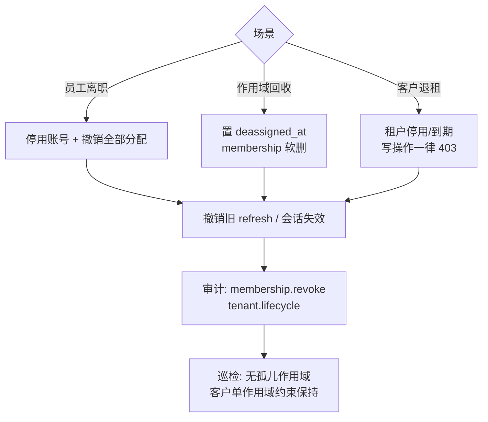

- **当前状态**：🟡 `Deactivate` 置 `deassigned_at`（`service/msp_allocation_service.go:196-209`），但**无审计、无用户停用/离职编排**；前端调用的 `/api/v1/msp/allocations/history` 后端不存在。
- **异常**：回收后旧会话仍有效 → 由每次请求的 membership 复核拦截（R2）；退租期数据导出/保留 → 按合规策略。

---

## F-09 密码重置（平台 SMTP 通道）

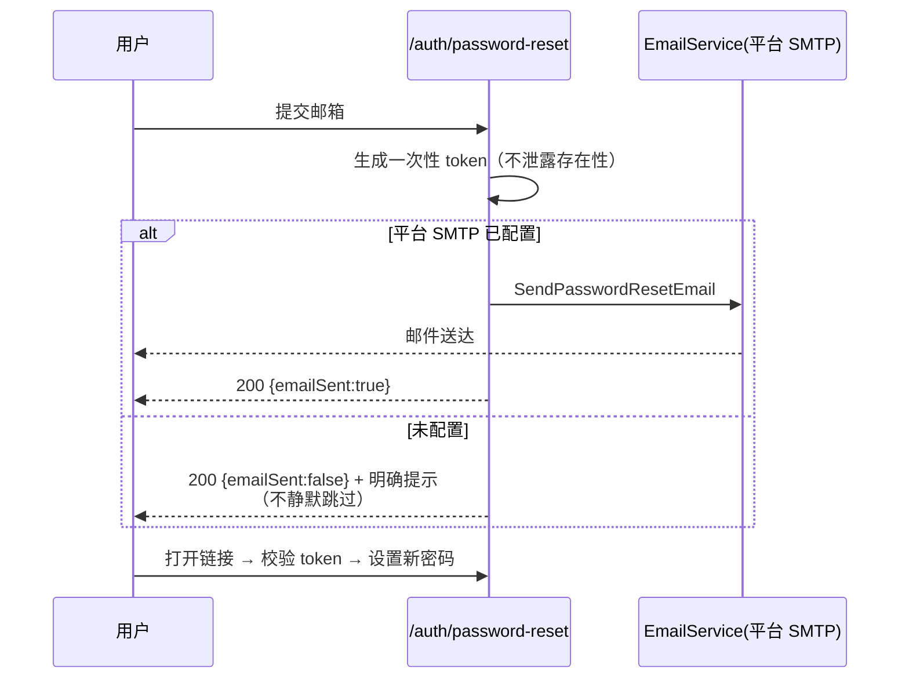

- **当前状态**：🟡 代码路径存在（`handlers/auth/service.go:234-238`），但 `EmailService` 未接线 → **静默跳过**（用户拿到 token 收不到信）；由[通知模块方案](../../plan/notification-module-design-plan-2026-09-29.md) P0-1 修复（接线 + `emailSent` 显式返回）。
- **审计点**：重置申请/完成；失败不泄露邮箱是否存在。

---

## F-10 会话续期（refresh 按 claim 租户）

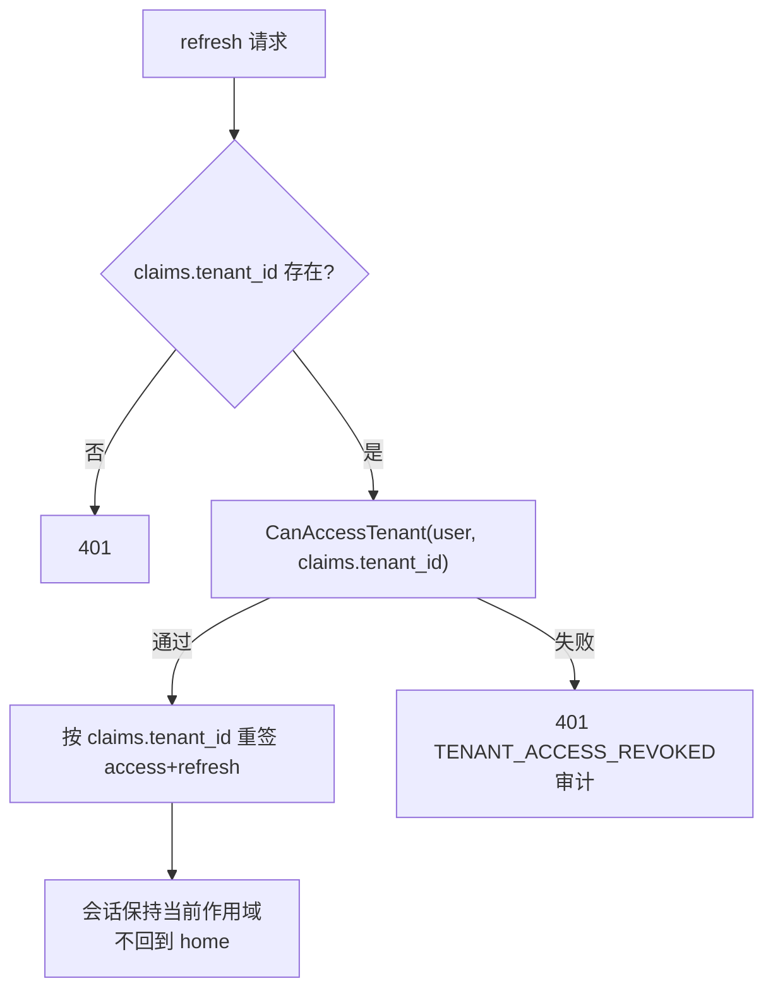

- **当前状态**：❌ 现状按 `user.TenantID`（home）重签 → **切换后任意刷新静默回退主租户（F10）**。
- **验收**：切换后连续 refresh 3 次，作用域不变；作用域被回收后 refresh → 401。

---

## 11. 状态机

### 11.1 邀请状态机（P1-1）

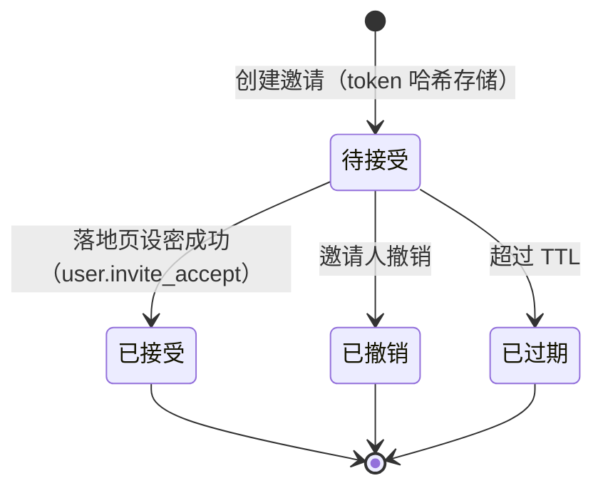

### 11.2 会话作用域状态机

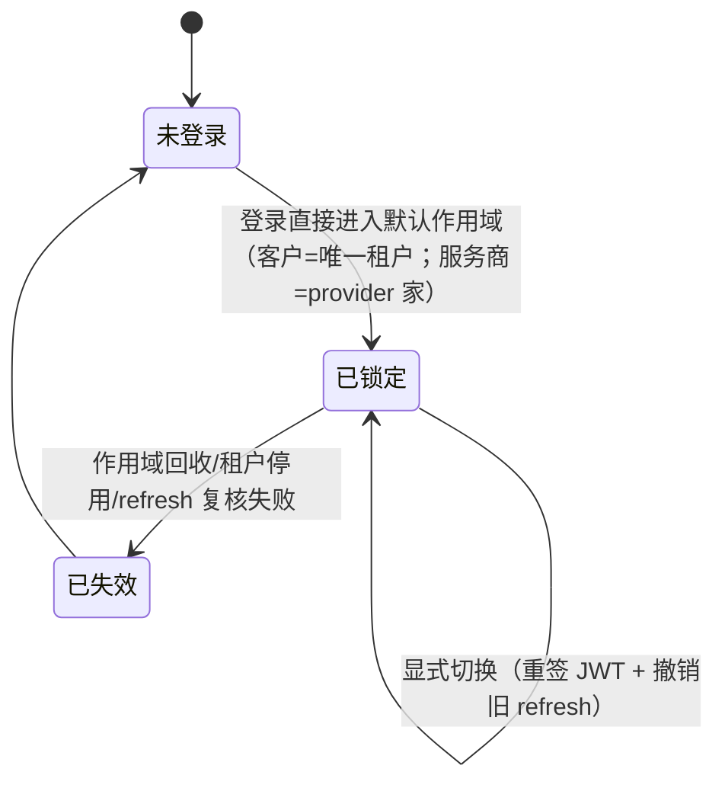

---

## 12. 流程 × 缺口 × 接口 对照表

| 流程 | 目标接口 | 现状 | 缺口/证据 |
|---|---|---|---|
| F-01 开通客户租户 | `POST /msp/customers` + `provision_tenant` | 🟡 | 无 MSP 开通端点；首个用户 SQL 直写；G2 |
| F-02 邀请激活 | `/users/invitations` + `/auth/invitations/:token` | ❌ | F4；邮件未接线；过渡用 bootstrap token（G2 冲突） |
| F-03 租户内建号 | `POST /users`、`/msp/customers/:id/users` | 🟡 | G1（跨租户被 hook 拦截）、roleRank 缺 `msp_*`、前端无目标租户 |
| F-04 登录解析 | `POST /auth/login`、`GET /auth/tenants` | 🟡 | F5（不校验租户状态）、F9（tenants 语义）、G3（角色覆盖）、F3（注册注入） |
| F-05 切换 | `POST /auth/switch-tenant` | 🟡 | F11（响应/权限）、F12（审计/撤销）、前端端点错误 |
| F-06 头通道 | `/msp/*` + `X-Customer-Tenant-ID` | 🟡 | F15（tenant_source 未审计）；`ValidateCustomerTenantHeader` 未挂载 |
| F-07 权限变更 | 角色模板 + 分配管理 | ❌ | Q7 模板未落地；`roleRank` 缺 `msp_*` |
| F-08 回收/退租 | `Deactivate` + 编排 | 🟡 | 无审计/编排；history 端点缺失 |
| F-09 密码重置 | `/auth/password-reset` | 🟡 | EmailService 未接线（静默跳过）→ 通知方案 P0-1 |
| F-10 续期 | `POST /auth/refresh` | ❌ | F10 静默回退 home |

**07 缺口映射**（按 07 文档 G1–G10 逐条核验）：G1→F-03（并 F-01/F-02）；G2→F-02（并 F-01）；G3→F-04/F-03（并 F-08）；G4/G5/G6/G7/G10→F-01（模板供给与部署路径）；G8（缓存租户维度）→F-05/F-09 上下文刷新；G9（`X-Tenant-Code` 冲突）→F-04/F-06 异常分支。

---

## 修订记录

| 版本 | 日期 | 变更 |
|---|---|---|
| v0.1 | 2026-09-29 | 首版：10 个用户交互流程（Mermaid）+ 邀请/会话两个状态机 + 流程×缺口×接口对照表；状态基于 HEAD `99eb4074` 逐流程核验（✅/🟡/❌） |
| v0.2 | 2026-09-29 | 新增 §0.5 FAQ（产品对齐）："服务商如何同时处理多个客户"——跨客户总览 / 头通道单请求只读 / 作用域切换三种方式对照、典型工作流、边界规则、现状 vs 目标；明确"不需要切换系统、同一前端、一个账号多作用域" |
| v0.3 | 2026-09-29 | **隐私约束修订**：登录页不得出现租户选择器/租户列表；F-04 改为"服务方登录落 provider 家、认证后顶栏切换"（原 `409 SCOPE_SELECTION_REQUIRED` + 登录页一次性选择作废）；§0.5 与 §11.2 状态机同步；登录响应不含候选列表（移至认证后 `/auth/tenants`）。见[登录与切换细化方案](./msp-login-and-switching-refinement-plan.md) |
